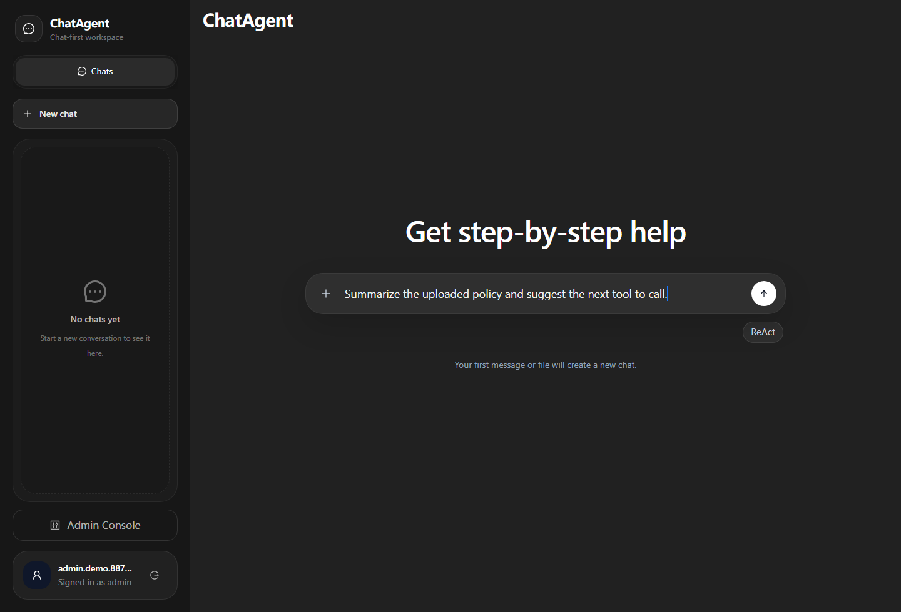
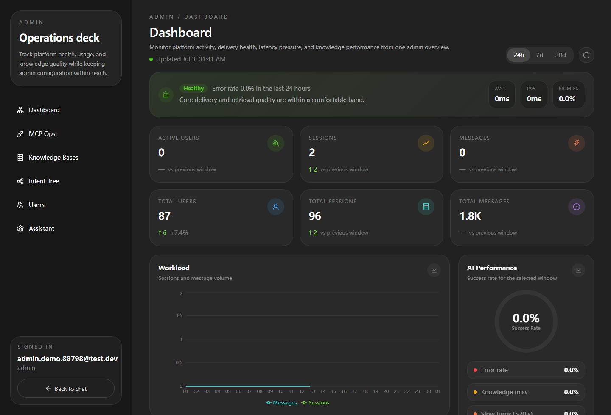
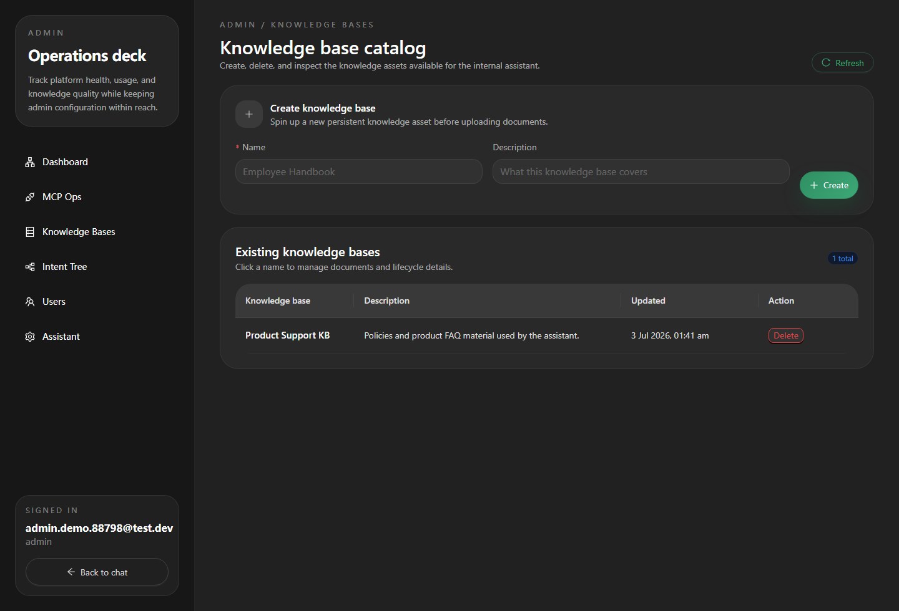
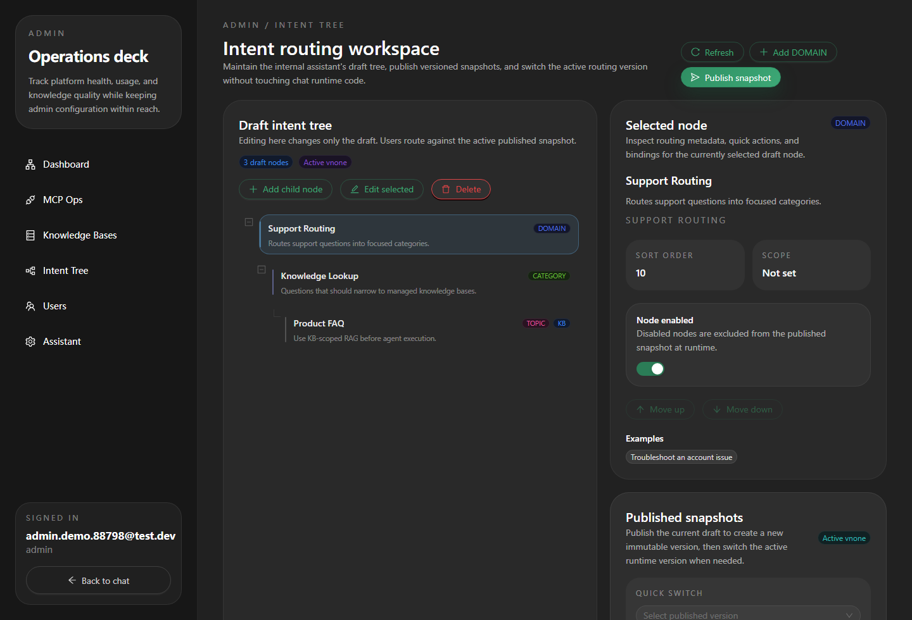
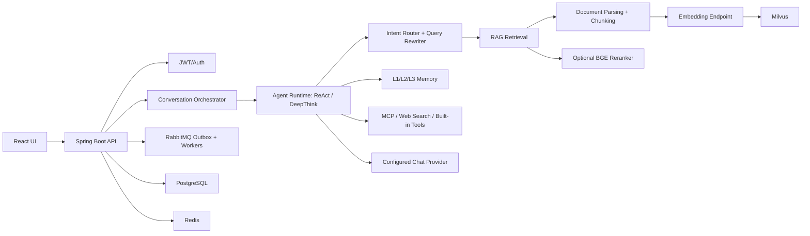

# ChatAgent

[Chinese README](README_ZH.md)

ChatAgent is a full-stack AI assistant platform. It combines a Spring Boot
backend, a React web client, RAG over uploaded documents and managed knowledge
bases, long-term memory, MCP tool integration, and a reproducible evaluation
toolchain for RAG, memory, and agent behavior.

The project is useful as a reference implementation for building an agentic
chat system that is not only interactive, but also measurable: ingestion,
retrieval, reranking, answer generation, memory extraction, intent routing, and
tool behavior all have dedicated runtime code and evaluation support.

## Application Screenshots

These screenshots were captured from the local React frontend connected to the
Spring Boot backend with Docker-backed PostgreSQL, Redis, RabbitMQ, and Milvus
services running.

| Chat workspace | Admin dashboard |
| --- | --- |
|  |  |

| Knowledge bases | Intent tree |
| --- | --- |
|  |  |

## Features

- Multi-turn chat sessions with server-sent events (SSE) streaming.
- JWT authentication with access tokens and HttpOnly refresh-token cookies.
- ReAct-style agent runtime plus a DeepThink execution mode for planning,
  execution, reflection, verification, and final synthesis.
- RAG over session files and admin-managed knowledge bases.
- Document ingestion for common office/web formats using Apache Tika, Apache
  POI, JSoup, Flexmark, optional MinerU PDF parsing, and optional VLM parsing.
- Embedding and vector retrieval through Ollama-compatible embedding endpoints
  and Milvus.
- Optional HTTP reranking through a local BGE reranker service.
- Intent tree management with draft, publish, and activate flows.
- Long-term memory with L1 recent context, L2 compaction, and L3 extracted
  memory items.
- MCP server management, tool catalog sync, test calls, rate limiting, circuit
  breaker protection, rollout control, and credential encryption hooks.
- Admin console for users, dashboard metrics, assistant templates, knowledge
  bases, intent tree, MCP operations, and chat routing.
- Python evaluation module for deterministic retrieval/text metrics, official
  Ragas runs, memory semantic judging, agent module checks, document ingestion
  analysis, and tuning workflows.

## Project Highlights

### First-Packet Model Routing

ChatAgent treats model availability as a runtime routing problem instead of a
static provider choice. The backend keeps a ranked candidate set and probes the
selected model by waiting for the first streamed packet within a bounded window.
This protects the user-facing chat flow from providers that accept a request but
stall before streaming useful output.

Key design points:

| Mechanism | What it does |
| --- | --- |
| Candidate priority | Orders provider/model candidates by configured priority and required capability. |
| First-packet probe | Marks a streaming attempt healthy only after the first packet arrives before the timeout. |
| Circuit states | Tracks closed, open, and half-open model health so degraded candidates can cool down before retry. |
| Runtime overrides | Admin chat-routing APIs can override or clear candidate choices without code changes. |
| Metrics | Micrometer counters/timers record routing attempts, latency, circuit events, and circuit decisions. |

This means provider failover is based on observable streaming behavior, not only
on HTTP connection success. It is especially important for long-running LLM calls
where a "200 OK" response is not enough to prove that the model is usable.

### Reliable MQ, Outbox, And Watchdog

The project uses RabbitMQ for asynchronous agent dispatch and document
ingestion, with PostgreSQL as the transactional source of truth for pending
messages. The core pattern is a transactional outbox: business state and the
message intent are committed together, then a polling publisher claims outbox
rows and publishes them to RabbitMQ with publisher confirms.

Important reliability details:

| Component | Responsibility |
| --- | --- |
| Transactional outbox | Prevents losing an agent or ingestion task after the user message/document state is saved. |
| Publisher confirm handling | Treats broker ack as sent; nack, return, or timeout becomes retryable state. |
| Retry and DLQ queues | Separate retry queues and a dead-letter queue keep poison messages observable. |
| Idempotency keys | Replayed messages preserve event identity so consumers can deduplicate safely. |
| Distributed locks | Agent-run, ingestion-task, and session-execution locks prevent duplicate workers from owning the same unit of work. |
| Lock watchdog | Periodically renews owned locks and reports lost ownership or failed renewal. |
| MQ admin surface | Admin code can inspect outbox states, retry/DLQ depths, and replay DLQ messages when appropriate. |

The resulting behavior is intentionally conservative: a turn can survive process
restarts, broker interruptions, publish-confirm timeouts, and worker overlap
without silently dropping work or running the same session turn twice.

### RAG Chain

RAG is implemented as a production chain rather than a single retrieval helper.
It supports both user session files and admin-managed knowledge bases.


The ingestion side normalizes Office, HTML, Markdown, text, and PDF-like inputs
with Apache Tika, Apache POI, JSoup, Flexmark, and optional MinerU/VLM parsing
for more difficult PDFs. The retrieval side separates recall-oriented candidate
collection from precision-oriented reranking, so tuning can adjust top-k,
candidate-k, RRF, reranker thresholds, timeouts, and fallback behavior
independently.

### Intent Recognition And Routing

Intent recognition sits before heavyweight agent execution. The assistant can
classify a turn, ask for clarification, bind the turn to an active intent-tree
topic, choose knowledge-base scope, and rewrite the query before RAG.

The intent tree has an operational lifecycle:

| Level | Purpose |
| --- | --- |
| Domain | Broad business area. |
| Category | Mid-level grouping under a domain. |
| Topic | Runtime-routable leaf; only topics bind knowledge bases. |

Admins edit a draft tree, publish a versioned snapshot, and activate the
published version used by runtime routing. Clarification outcomes short-circuit
the normal agent path and return a direct clarifying response, which avoids
spending tool/RAG/model budget on under-specified turns.

### RAGAS And Evaluation Metrics

The evaluation module is designed to make the RAG chain measurable. The current
B3.4 answer-quality scope focuses on full-RAG answer rows and scores only:

| Metric | Meaning |
| --- | --- |
| `faithfulness` | Whether the generated answer is supported by the retrieved context. |
| `factual_correctness` | Whether the generated answer matches the reference answer/facts. |

Older No-RAG, wrong-context, oracle, reranker A/B controls and extra RAGAS
metrics are intentionally out of the active scope unless they are explicitly
reopened.

The deterministic retrieval metrics follow standard IR definitions:

| Metric | Calculation |
| --- | --- |
| Hit@K | `1` if at least one relevant item appears in the top K results, otherwise `0`; averaged across queries. |
| Recall@K | Relevant items retrieved in top K divided by total relevant items for that query. |
| Precision@K | Relevant items retrieved in top K divided by K. |
| MRR | Reciprocal rank of the first relevant result; `1/rank`, or `0` if none is found. |
| NDCG@K | Discounted gain of ranked relevant results normalized by the best possible ranking. |

These metrics are standard information-retrieval measurements and complement
RAGAS: retrieval metrics explain whether the right evidence was found, while
RAGAS explains whether the final answer stayed faithful and factually correct.

## Project Structure

```text
ChatAgent/
|- chatagent/                         # Java backend workspace
|  |- pom.xml                         # Maven parent project
|  |- framework/                      # Shared API response, errors, SSE, trace, async, CORS
|  |- infra/                          # Provider and outbound integrations
|  `- bootstrap/                      # Spring Boot app and business modules
|     |- src/main/java/com/yulong/chatagent/
|     |  |- agent/                    # ReAct, DeepThink, runtime context, prompts
|     |  |- conversation/             # Sessions, messages, turn orchestration, SSE
|     |  |- rag/                      # Parsing, chunking, embedding, retrieval, rerank
|     |  |- memory/                   # L1/L2/L3 memory
|     |  |- intent/                   # Intent tree, query rewrite, routing
|     |  |- knowledge/                # Knowledge-base and document management
|     |  |- mcp/                      # MCP runtime integration
|     |  |- mq/                       # RabbitMQ/outbox/locks
|     |  |- user/, admin/, file/      # Auth, admin APIs, session attachments
|     |  `- support/                  # Shared DTOs, persistence, health
|     |- src/main/resources/
|     |  |- application.yaml          # Main runtime configuration
|     |  |- db/migration/             # Flyway migrations
|     |  `- prompts/                  # Markdown prompt templates
|     `- src/test/                    # Backend unit, integration, eval tests
|- ui/                                # React + Vite frontend
|- tools/
|  |- eval/                           # Python evaluation runners and tests
|  |- bge-reranker-server/            # Local HTTP reranker service
|  `- mineru/                         # Local MinerU service scripts
|- MCP/weather-server/                # Example MCP HTTP/SSE server
|- docker-compose.yml                # Local middleware (PostgreSQL, Redis, RabbitMQ)
|- README.md
|- README_ZH.md
`- LICENSE
```

Local/private documentation, artifacts, model weights, runtime data, virtual
environments, IDE files, and secret-bearing notes are intentionally ignored by
Git.

## Technology Stack

| Area | Technology |
| --- | --- |
| Backend | Java 17, Spring Boot 3.5.8, Spring Web, WebFlux, Actuator |
| AI provider layer | Spring AI BOM 1.1.0, DeepSeek-compatible and ZhipuAI-compatible configuration |
| Persistence | PostgreSQL, MyBatis, Flyway |
| Cache and coordination | Redis, Caffeine, session guards, distributed locks |
| Messaging | RabbitMQ, Spring AMQP, outbox and retry/DLQ flows |
| RAG parsing | Apache Tika, Apache POI, JSoup, Flexmark, optional MinerU, optional VLM parser |
| Retrieval | Ollama-compatible embeddings, Milvus vector store, optional BGE HTTP reranker |
| Security | JWT, BCrypt, Spring Security Crypto, role annotations |
| Observability | Spring Boot Actuator, Micrometer Prometheus registry |
| Frontend | React 19, TypeScript 5.9, Vite 7, Ant Design 6, Ant Design X, Tailwind CSS 4 |
| Frontend tests | Vitest, Testing Library, jsdom |
| Evaluation | Python 3.11, optional `ragas`, optional OpenAI-compatible clients |
| Local tools | MinerU service scripts, BGE reranker service, example MCP weather server |

## Installation

### Prerequisites

| Dependency | Required for | Notes |
| --- | --- | --- |
| JDK 17 | Backend build and runtime | Set `JAVA_HOME` before running Maven. |
| Maven wrapper | Backend build | `chatagent/mvnw` and `chatagent/mvnw.cmd` are included. |
| Node.js 20+ | Frontend | The project uses Vite and React 19. |
| Python 3.11+ | Evaluation tools and local AI helpers | Required for `tools/eval`, MinerU, and reranker services. |
| PostgreSQL | Application database | Flyway migrations create and evolve the schema. |
| Redis | Cache, locks, and coordination | Required by the backend configuration. |
| RabbitMQ | Async agent and ingestion flows | Used by MQ/outbox modules. |
| Milvus | Vector store | Required when `CHATAGENT_MILVUS_ENABLED=true`. |
| Ollama or compatible embedding API | Embeddings | Defaults target `http://127.0.0.1:11434`. |
| Optional GPU | MinerU/reranker acceleration | CPU mode may work but can be slow. |

### Clone

```bash
git clone <repository-url>
cd ChatAgent
```

### Backend dependencies

```powershell
cd chatagent
.\mvnw.cmd -pl bootstrap -am -DskipTests install
```

On Linux/macOS:

```bash
cd chatagent
./mvnw -pl bootstrap -am -DskipTests install
```

### Frontend dependencies

```bash
cd ui
npm install
```

### Python evaluation tools

```bash
cd tools/eval
python -m venv .venv
# Windows: .\.venv\Scripts\Activate.ps1
# Unix: source .venv/bin/activate
python -m pip install -e .
python -m pip install -e ".[ragas]"   # only when official Ragas metrics are needed
```

## Configuration

Runtime configuration is defined in
`chatagent/bootstrap/src/main/resources/application.yaml` and profile-specific
YAML files such as `application-local-gpu.yaml`. Non-sensitive defaults live in
those YAML files: model names, local service URLs, timeouts, MQ names, feature
switches, RAG top-k/candidate-k/RRF values, reranker thresholds, and MCP
runtime limits are committed as ordinary configuration.

Backend environment variables are reserved for secrets and credentials.
`chatagent/.env.example` therefore documents only the private values to supply
locally. Non-sensitive endpoints, usernames, feature switches, limits, and
tuning values are documented beside their defaults in application YAML.

Do not commit real API keys, JWT secrets, database passwords, or local provider
tokens. The local `docs/env_variables.txt` file may contain private values and
is intentionally ignored.

### Private Environment Variables

| Variable | Required | Purpose |
| --- | --- | --- |
| `CHATAGENT_DB_PASSWORD` | Yes in most setups | PostgreSQL password. |
| `CHATAGENT_REDIS_PASSWORD` | Depends on Redis | Redis password. |
| `CHATAGENT_RABBITMQ_PASSWORD` | Yes for MQ flows | RabbitMQ password. |
| `CHATAGENT_DEEPSEEK_API_KEY` | If using DeepSeek | Chat provider credential. |
| `CHATAGENT_ZAI_CODING_API_KEY` | If using Z.AI Coding | Z.AI Coding Plan provider credential. |
| `CHATAGENT_ZHIPUAI_API_KEY` | If using ZhipuAI | Chat/VLM provider credential. |
| `CHATAGENT_ZHIPUAI_API_KEY_2` | Optional for evaluation | Secondary ZhipuAI provider credential. |
| `CHATAGENT_RAG_RERANKER_API_KEY` | If the reranker requires auth | Reranker credential. |
| `CHATAGENT_RAG_VDP_MINERU_BEARER_TOKEN` | If MinerU requires auth | MinerU bearer token. |
| `CHATAGENT_MILVUS_PASSWORD` | If Milvus auth is enabled | Milvus password. |
| `CHATAGENT_WEB_SEARCH_BRAVE_API_KEY` | If native web search is enabled | Brave Search credential. |
| `CHATAGENT_MCP_CIPHER_KEY` | Required for encrypted MCP credentials | Secret key for MCP credential encryption. |
| `CHATAGENT_JWT_SECRET` | Yes outside throwaway local runs | Long random JWT signing secret. |

To change non-sensitive defaults, edit the YAML profile rather than adding new
environment variables. Evaluation-only provider overrides still live in the
Python evaluation CLI where noted by `tools/eval`.

## Usage

### Start Local Infrastructure

The repository includes a `docker-compose.yml` that starts PostgreSQL, Redis,
and RabbitMQ together:

```bash
docker compose up -d
```

Or start each dependency individually:

```bash
docker run -d --name chatagent-postgres -p 5432:5432 \
  -e POSTGRES_DB=chatagent \
  -e POSTGRES_USER=app \
  -e POSTGRES_PASSWORD=app \
  postgres:16

docker run -d --name chatagent-redis -p 6379:6379 redis:7

docker run -d --name chatagent-rabbitmq -p 5672:5672 -p 15672:15672 \
  -e RABBITMQ_DEFAULT_USER=guest \
  -e RABBITMQ_DEFAULT_PASS=guest \
  rabbitmq:3.13-management
```

Milvus and Ollama are installed separately. For local Milvus, the repository also
includes a `docker-compose-milvus.yml` (Milvus standalone + etcd + minio, persisted
via named volumes):

```bash
docker compose -f docker-compose-milvus.yml up -d
```

Enable it in the backend with `CHATAGENT_MILVUS_ENABLED=true`. For an Ollama embedding setup:

```bash
ollama pull bge-m3
```

### Start Optional Local AI Services

BGE reranker:

```powershell
.\tools\bge-reranker-server\start-reranker.ps1
```

MinerU:

```powershell
.\tools\mineru\check-mineru-env.ps1
.\tools\mineru\download-models.ps1 -Source huggingface -ModelType pipeline
.\tools\mineru\start-mineru-api.ps1
```

### Start Backend

```powershell
cd chatagent
.\mvnw.cmd -pl bootstrap spring-boot:run
```

The backend uses Spring Boot's default port unless overridden by your local
Spring configuration. The frontend assumes `http://localhost:8080/api` by
default.

### Start Frontend

```bash
cd ui
npm run dev
```

Open the Vite URL shown in the terminal, usually `http://localhost:5173`.

### Smoke Checks

```bash
curl http://localhost:8080/health
curl http://localhost:8080/api/user/me
```

`/api/user/me` requires a valid access token after login.

## API

All JSON endpoints return:

```json
{
  "code": 200,
  "message": "success",
  "data": {}
}
```

Use `Authorization: Bearer <access-token>` for authenticated requests. The
refresh token is managed by an HttpOnly cookie.

| Area | Method and Path | Main Parameters |
| --- | --- | --- |
| Auth | `POST /api/auth/register` | JSON: `username`, `password` |
| Auth | `POST /api/auth/login` | JSON: `username`, `password` |
| Auth | `POST /api/auth/refresh` | Refresh token cookie |
| Auth | `POST /api/auth/logout` | Refresh token cookie |
| User | `GET /api/user/me` | Bearer token |
| Sessions | `GET /api/chat-sessions` | Bearer token |
| Sessions | `POST /api/chat-sessions` | JSON: `title` |
| Sessions | `GET/PATCH/DELETE /api/chat-sessions/{chatSessionId}` | JSON patch: `title` |
| Messages | `GET /api/chat-messages/session/{sessionId}` | Session ID |
| Messages | `POST /api/chat-messages` | JSON: `sessionId`, `role`, `content`, optional `turnId`, `executionMode`, `metadata` |
| Messages | `PATCH/DELETE /api/chat-messages/{chatMessageId}` | JSON patch: `content`, `metadata` |
| SSE | `GET /api/sse/connect/{chatSessionId}` | SSE stream for chat progress and content |
| Session files | `POST /api/chat-sessions/{sessionId}/files/upload` | Multipart field: `file` |
| Session files | `GET /api/chat-sessions/{sessionId}/files` | Session ID |
| Session files | `DELETE /api/chat-sessions/{sessionId}/files/{sessionFileId}` | IDs in path |
| Knowledge base | `POST /api/admin/knowledge-bases` | Admin, JSON: `name`, `description` |
| Knowledge base | `GET/PATCH/DELETE /api/admin/knowledge-bases/{knowledgeBaseId}` | Admin |
| Knowledge documents | `POST /api/admin/knowledge-bases/{knowledgeBaseId}/documents/upload` | Admin, multipart `file` |
| Knowledge documents | `POST /api/admin/knowledge-bases/{knowledgeBaseId}/documents/{documentId}/replace` | Admin, multipart `file` |
| Assistant templates | `GET/POST/PATCH/DELETE /api/admin/assistant/templates` | Admin, template fields |
| Intent tree | `GET /api/admin/assistant/intent-tree` | Admin |
| Intent tree | `POST/PATCH/DELETE /api/admin/assistant/intent-tree/nodes` | Admin, intent-node payload |
| Intent tree | `POST /api/admin/assistant/intent-tree/publish` | Admin |
| MCP servers | `GET/POST/PATCH/DELETE /api/admin/mcp-servers` | Admin, `slug`, `name`, `protocol`, `authType`, `endpointUrl`, `credentials` |
| MCP servers | `POST /api/admin/mcp-servers/{serverId}/test` | Admin |
| MCP servers | `POST /api/admin/mcp-servers/{serverId}/sync` | Admin |
| Dashboard | `GET /api/admin/dashboard/overview` | Admin, optional `window` |
| Health | `GET /health` | Basic health response |

## System Architecture



### Data Flow

1. A user logs in and creates a chat session.
2. The frontend sends `POST /api/chat-messages` and opens the SSE stream.
3. The backend acquires a session guard and starts one turn.
4. The orchestrator prepares intent, memory context, attached files, and
   knowledge-base scope.
5. The agent runtime selects direct answering, RAG, tools, web search, or
   DeepThink steps depending on the turn.
6. RAG parses and chunks documents, creates embeddings, stores vectors in
   Milvus, retrieves top candidates, optionally reranks them, and formats
   cited context.
7. The selected chat provider generates the assistant response.
8. Messages, traces, memory updates, MQ state, and admin metrics are persisted
   or streamed as appropriate.

### Model Calling Flow

- `ChatModelRouter` selects the configured provider/model.
- Runtime modules pass prompts through `PromptLoader`.
- Provider settings such as model, temperature, top-p, and max tokens are
  controlled by environment variables.
- DeepThink uses dedicated planner, step executor, reflection, verification,
  and final synthesis prompt paths.
- RAG and memory modules can use separate model settings for query rewrite,
  summarization, VLM parsing, document enhancement, and L3 extraction.

### Prompt Design

Prompt templates are stored as Markdown under:

```text
chatagent/bootstrap/src/main/resources/prompts/
```

They are loaded lazily from `classpath:prompts/` by `PromptLoader`. This keeps
large prompt text out of Java service code and allows runtime modules such as
agent execution, DeepThink, intent routing, query rewriting, RAG formatting,
VLM parsing, document enhancement, and memory extraction to share a consistent
template-loading pattern.

### Vector Search and Retrieval

1. Documents are uploaded to a session or knowledge base.
2. Parsers normalize PDF, Office, HTML, Markdown, text, and related formats.
3. Content is chunked and optionally enriched.
4. Embeddings are generated through an Ollama-compatible endpoint.
5. Vectors are stored in Milvus collections.
6. Runtime retrieval uses top-k, candidate-k, and RRF settings.
7. Optional HTTP reranking filters or reorders candidates before answer
   generation.

## Evaluation

The evaluation module lives in `tools/eval` and is opt-in. It is not part of
the default backend test lifecycle.

```bash
cd tools/eval
python run_eval.py --help
```

Main runner groups include:

| Runner | Purpose |
| --- | --- |
| `ragas-smoke` | Run official Ragas metrics over exported samples. |
| `text-recall-smoke` | Deterministic text recall over real source files. |
| `memory-smoke` | Deterministic Memory V2 checks over multi-turn tasks. |
| `memory-semantic` | Semantic support/usefulness judging for memory. |
| `agent-modules-smoke` | Intent, rewrite, tool-call, and module checks. |
| `doc-ingestion-preflight` | Preflight validation for document ingestion evals. |
| `doc-ingestion-answer` | Generate answer rows for B3.4 style RAGAS scoring. |
| `tune-suite` | Reproducible parameter tuning with sealed holdout support. |

For the current B3.4 answer-quality workflow, the active RAGAS run exports
full-RAG answer rows and scores `faithfulness` plus `factual_correctness`.
Historical No-RAG, wrong-context, oracle, reranker A/B controls and additional
RAGAS metrics are not part of the active default unless explicitly re-enabled.

Tracked deterministic metrics include Hit@K, Recall@K, Precision@K, MRR, NDCG,
and text recall. Memory runs track precision, recall, F1, support, and
usefulness. Agent module runs track metrics such as intent accuracy.

Generated evaluation artifacts are local-only and ignored by Git.

## Development Guide

### Backend

```powershell
cd chatagent
.\mvnw.cmd -pl bootstrap -DskipTests test-compile
.\mvnw.cmd -pl bootstrap test
```

Default Maven tests exclude long-running or live suites through
`surefire.excludedGroups`. Opt-in evaluation and reliability suites use tags
such as `eval-v2`, `benchmark`, `reliability-live`, `stress`, and `chaos`.

### Frontend

```bash
cd ui
npm run lint
npm run test
npm run build
```

### End-to-End (Formal Playwright)

The primary browser E2E suite now uses formal Playwright specs under
`ui/e2e/specs`. The backend must already be running on `localhost:8080`; the
Playwright config starts Vite on `localhost:5173` and keeps one Chromium worker
so refresh-cookie storage state stays stable.

```bash
cd ui
npm run e2e:install          # one-time: download Chromium
npm run e2e                  # formal Playwright specs, headless by default
npm run e2e:headed -- --grep @smoke
npm run e2e:headed -- --grep "@smoke|@core-agent"
npm run e2e:headed:full      # headed tier sequence with a fresh run id per tier
```

Useful tier tags:

| Tag | Coverage |
| --- | --- |
| `@smoke` | Auth, refresh, route guards, basic session shell. |
| `@core-agent` | Language following, ReAct, DeepThink, SSE recovery. |
| `@memory` | L1/L2/L3 memory and multi-turn relevance. |
| `@rag` | KB ingestion/retrieval, citations, evidence rendering, session files. |
| `@tools` | MCP, web search fixture, safe built-in tools. |
| `@intent` | Intent-tree draft/publish/activate and runtime hit behavior. |
| `@routing` | First-packet routing fixture and real-provider smoke. |
| `@admin` | Dashboard, users, KBs, assistant bindings, MCP Ops, MQ/routing evidence. |
| `@vlm` | Multimodal/session-file provider capability path. |

Some tiers need local fixtures before running:

```powershell
.\MCP\weather-server\start-http.ps1              # needed by @tools and @admin MCP paths
cd ui
npm run e2e:routing-fixture                      # needed by @routing fixture mode
# Native web search uses Brave LLM Context; configure the backend-only Brave key.
```

Keep the browser/API origins on `localhost`, not `127.0.0.1`, so auth cookies
rehydrate consistently. Set `PLAYWRIGHT_UI_BASE_URL` and
`PLAYWRIGHT_API_BASE_URL` only when using different local ports.

`npm run e2e:headed:full` runs the existing tiers one by one instead of using a
single `@full` grep tag. This avoids duplicate generated-user IDs between
Playwright processes and makes long runs easier to diagnose. For the `@routing`
tier, the full runner defaults to `PLAYWRIGHT_ROUTING_PROVIDER_MODE=real` when
the variable is unset so it works against the normal configured backend. Set
`PLAYWRIGHT_ROUTING_PROVIDER_MODE=fixture`, start the routing fixture, and point
the backend provider base URLs at it when you need deterministic fault-injection
routing coverage.

`CHATAGENT_JWT_SECRET` (>=32 bytes) and local database credentials are required
to boot the backend and promote the generated admin fixture. Load private values
from your ignored local environment; do not commit or paste values from
`docs/env_variables.txt`.

### End-to-End (Manual AX Driver)

The older exploratory Playwright AX driver is still available when you want a
headed, persistent browser exposed over a small HTTP API:

```bash
cd ui
npm run e2e:driver              # driver on http://127.0.0.1:7878
```

Then drive it manually:

```bash
curl -X POST localhost:7878/goto -d '{"url":"http://localhost:5173/"}'
curl localhost:7878/ax
curl -X POST localhost:7878/act -d '{"locator":{"role":"button","name":"Log in"},"action":"click"}'
```

### Evaluation Tools

```bash
cd tools/eval
python -m unittest discover -s tests -v
python -m compileall -q chatagent_eval tests
```

### Code and Documentation Rules

- Start each distinct task on its matching feature branch, keep all phases and
  review fixes for that task on the same branch, and checkpoint each phase only
  after cross-review acceptance.
- Keep secrets out of source, docs, tests, artifacts, and logs.
- Keep generated artifacts under ignored directories.
- Prefer environment variables over hardcoded local paths.
- Update README/API notes when public endpoints or required config changes.
- For AI behavior changes, add or update targeted eval evidence where
  practical.

## Deployment

There is no production-ready deployment manifest in this repository yet.
Production deployment needs to supplement:

- Container images or a platform-specific service definition.
- Managed PostgreSQL, Redis, RabbitMQ, Milvus, and object/file storage.
- Secret management for provider keys, JWT secrets, MCP cipher keys, and
  database credentials.
- TLS, domain routing, CORS policy, and frontend build hosting.
- Log, metric, alert, and artifact-retention policies.
- GPU or CPU capacity planning for MinerU, reranker, embeddings, and local
  models if used.

A minimal backend package can be built with:

```powershell
cd chatagent
.\mvnw.cmd -pl bootstrap -am -DskipTests package
```

Frontend production build:

```bash
cd ui
npm run build
```

## FAQ

### The backend cannot connect to PostgreSQL.

Check `spring.datasource.url` and `spring.datasource.username` in
`application.yaml`, then check `CHATAGENT_DB_PASSWORD`. Also confirm the
database exists and Flyway can create or update the schema.

### Login works but authenticated API calls fail.

Check `CHATAGENT_JWT_SECRET`, browser cookie behavior, CORS settings, and the
`Authorization: Bearer <access-token>` header.

### RAG returns no useful context.

Confirm embeddings are available, Milvus is enabled and reachable, the vector
dimension matches the embedding model, documents were ingested successfully,
and the reranker is either healthy or intentionally disabled.

### PDF parsing is slow or incomplete.

Start MinerU when visual/PDF parsing is needed and verify
`CHATAGENT_RAG_VDP_MINERU_BASE_URL`. CPU-only parsing can be slow.

### The frontend calls the wrong backend URL.

Set `VITE_API_BASE_URL` before running `npm run dev` or building the frontend.

### Evaluation artifacts are missing.

Evaluation runs write local artifacts under ignored directories. Run the
relevant `tools/eval/run_eval.py` command first, then inspect the generated
manifest/report paths printed by the runner.

## License

This project is licensed under the MIT License. See [LICENSE](LICENSE).
