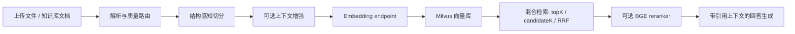
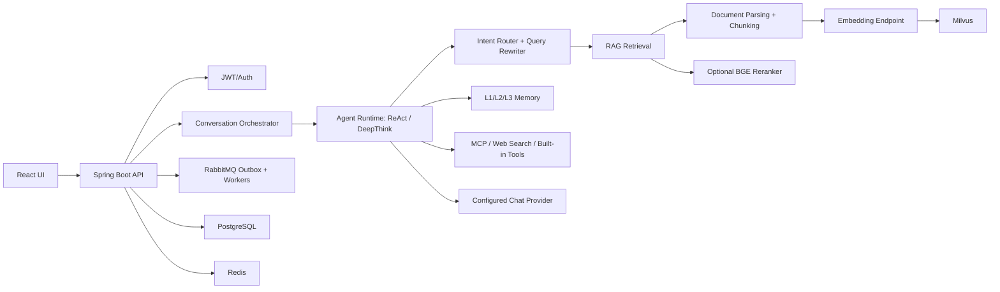

# ChatAgent

[English README](README.md)

ChatAgent 是一个全栈 AI 助手平台，包含 Spring Boot 后端、React 前端、基于文档和知识库的 RAG、长期记忆、MCP 工具接入，以及覆盖 RAG、Memory、Agent 行为的可复现实验评测工具链。

这个项目的核心价值不只是“能聊天”，而是把一个 Agent 系统拆成可运行、可管理、可评测的工程模块：文档解析、切分、向量化、检索、重排、回答生成、记忆抽取、意图路由和工具调用都有对应的运行链路与评测支持。

## 功能特性

- 多轮聊天会话，支持 SSE 流式输出。
- JWT 登录鉴权，access token 由前端携带，refresh token 使用 HttpOnly Cookie。
- ReAct Agent 运行时，并支持 DeepThink 模式，用于规划、执行、反思、验证和最终综合。
- 支持会话文件和后台知识库两类 RAG 数据来源。
- 支持多格式文档摄取：Apache Tika、Apache POI、JSoup、Flexmark，PDF 可接入 MinerU 和 VLM 解析。
- 支持 Ollama 兼容 embedding 服务、Milvus 向量库和可选 BGE HTTP reranker。
- 后台可维护意图树，包含草稿、发布、版本激活流程。
- 记忆系统包含 L1 近期上下文、L2 压缩摘要/片段、L3 长期记忆条目。
- MCP 服务器管理、工具目录同步、连通性测试、限流、熔断、灰度和凭据加密能力。
- 管理后台覆盖用户、仪表盘、助手模板、知识库、意图树、MCP 运维和聊天路由。
- Python 评测模块支持确定性检索/文本指标、官方 Ragas、Memory 语义评测、Agent 模块评测、文档摄取分析和参数调优。

## 项目亮点

### 首包探测与模型路由

ChatAgent 没有把模型选择写死成单一 provider，而是把它设计成一个运行时路由问题。后端维护按优先级排序的候选模型，并通过“首包探测”判断一个流式模型是否真的可用：请求发出后，只有在限定时间内收到第一段流式输出，才把本次调用视为健康。

关键机制：

| 机制 | 作用 |
| --- | --- |
| 候选模型优先级 | 按 provider/model 的优先级和能力要求选择候选。 |
| 首包探测 | 不只看 HTTP 是否连通，而是等待第一段 stream packet，避免 provider 卡住却占用用户 turn。 |
| 熔断状态 | 跟踪 closed、open、half-open 状态，让异常模型冷却后再探测恢复。 |
| 运行时 override | 后台 chat-routing API 可临时覆盖或清除候选，不需要改代码。 |
| 指标观测 | 使用 Micrometer 记录路由尝试、延迟、熔断事件和决策。 |

这个设计解决的是 LLM 工程里的实际问题：一次 `200 OK` 并不代表模型能稳定输出。对聊天系统来说，真正影响体验的是首包是否及时返回、失败后能不能自动切换到可用候选。

### MQ、Outbox 与看门狗

项目使用 RabbitMQ 承载异步 Agent 调度和知识库文档摄取，并用 PostgreSQL transactional outbox 保证业务状态与消息意图一起提交。用户消息或文档状态保存成功后，即使进程重启或 RabbitMQ 短暂不可用，待发布任务仍然保留在 outbox 中。

可靠性设计：

| 组件 | 职责 |
| --- | --- |
| Transactional outbox | 避免“消息已保存但任务丢失”或“任务发出但业务状态未提交”。 |
| Publisher confirm | broker ack 后标记 sent；nack、return、timeout 进入可重试状态。 |
| Retry/DLQ | retry queue 处理暂时失败，DLQ 暴露 poison message，便于排查和重放。 |
| Idempotency key | DLQ 重放保留事件身份，消费者可做幂等保护。 |
| 分布式锁 | agent-run、ingest-task、session-exec 锁防止多个 worker 同时处理同一任务。 |
| Lock watchdog | 周期性续租锁，并记录锁丢失或续租失败。 |
| MQ 后台管理 | 可查看 outbox 状态、retry/DLQ 深度，并在合适时重放 DLQ 消息。 |

这套链路的目标是“可恢复、可观测、可重放”：普通 broker 波动、confirm 超时、worker 重启、重复投递都不应让会话 turn 静默丢失或重复执行。

### RAG 链路

RAG 在本项目里不是一个简单的 retrieval helper，而是一条完整生产链路，覆盖会话文件和后台知识库两类数据源。



摄取侧使用 Apache Tika、Apache POI、JSoup、Flexmark 处理 Office、HTML、Markdown、文本等格式；复杂 PDF 可接入 MinerU 或 VLM 解析。检索侧把召回和精排拆开：top-k、candidate-k、RRF、reranker 阈值、超时和 fallback 都可以独立调优。

### 意图识别与路由

意图识别发生在重型 Agent 执行之前。系统会先判断用户 turn 是否需要澄清、是否能绑定到意图树 topic、应该使用哪些知识库范围，以及是否需要查询改写，再决定是否进入 RAG 或工具执行。

意图树的层级：

| 层级 | 作用 |
| --- | --- |
| Domain | 最高层业务领域。 |
| Category | 领域下的中间分类。 |
| Topic | 可运行时路由的叶子节点；只有 Topic 绑定知识库。 |

后台维护草稿树，发布后形成版本化 snapshot，再激活某个已发布版本供运行时读取。若当前问题信息不足，澄清结果会直接返回给用户，不进入 Agent runtime，从而节省模型、工具和 RAG 预算。

### RAGAS 评测与指标

评测模块用于把 RAG 链路变成可度量的工程对象。当前 B3.4 回答质量评测的有效范围是：只评估 full-RAG answer rows，并只计算：

| 指标 | 含义 |
| --- | --- |
| `faithfulness` | 生成答案是否被检索上下文支持。 |
| `factual_correctness` | 生成答案是否与参考答案/事实一致。 |

旧的 No-RAG、wrong-context、oracle、reranker A/B 对照组，以及额外 RAGAS 指标，当前不属于默认有效范围，除非后续明确重新开启。

确定性检索指标采用业界常见 IR 定义：

| 指标 | 计算方式 |
| --- | --- |
| Hit@K | top K 中至少出现一个相关结果则为 `1`，否则为 `0`，再对 query 求平均。 |
| Recall@K | top K 中召回的相关结果数 / 该 query 的相关结果总数。 |
| Precision@K | top K 中相关结果数 / K。 |
| MRR | 第一个相关结果排名的倒数，即 `1/rank`；没有相关结果则为 `0`。 |
| NDCG@K | 按排名折损后的相关性收益，再除以理想排序下的收益。 |

这些指标和 RAGAS 分工不同：检索指标回答“证据有没有找对”，RAGAS 回答“最终答案有没有忠于证据并符合事实”。

## 项目结构

```text
ChatAgent/
|- chatagent/                         # Java 后端工作区
|  |- pom.xml                         # Maven 父工程
|  |- framework/                      # API 响应、异常、SSE、Trace、异步、CORS 等通用能力
|  |- infra/                          # Provider 与外部集成
|  `- bootstrap/                      # Spring Boot 启动模块和业务模块
|     |- src/main/java/com/yulong/chatagent/
|     |  |- agent/                    # ReAct、DeepThink、运行上下文、Prompt
|     |  |- conversation/             # 会话、消息、单轮编排、SSE
|     |  |- rag/                      # 解析、切分、向量化、检索、重排
|     |  |- memory/                   # L1/L2/L3 记忆
|     |  |- intent/                   # 意图树、查询改写、路由
|     |  |- knowledge/                # 知识库与文档管理
|     |  |- mcp/                      # MCP 运行时集成
|     |  |- mq/                       # RabbitMQ、outbox、锁
|     |  |- user/, admin/, file/      # 鉴权、后台接口、会话附件
|     |  `- support/                  # 共享 DTO、持久化、健康检查
|     |- src/main/resources/
|     |  |- application.yaml          # 主配置文件
|     |  |- db/migration/             # Flyway 迁移
|     |  `- prompts/                  # Markdown Prompt 模板
|     `- src/test/                    # 后端单测、集成测试、评测测试
|- ui/                                # React + Vite 前端
|- tools/
|  |- eval/                           # Python 评测 runner 和测试
|  |- bge-reranker-server/            # 本地 HTTP reranker 服务
|  `- mineru/                         # 本地 MinerU 服务脚本
|- MCP/weather-server/                # 示例 MCP HTTP/SSE 服务
|- docker-compose.yml                # 本地中间件（PostgreSQL、Redis、RabbitMQ）
|- README.md
|- README_ZH.md
`- LICENSE
```

本地/私有文档、artifact、模型权重、运行数据、虚拟环境、IDE 文件和包含敏感值的本地记录都已通过 Git 忽略。

## 技术栈

| 领域 | 技术 |
| --- | --- |
| 后端 | Java 17, Spring Boot 3.5.8, Spring Web, WebFlux, Actuator |
| AI Provider 层 | Spring AI BOM 1.1.0, DeepSeek 兼容配置, ZhipuAI 兼容配置 |
| 持久化 | PostgreSQL, MyBatis, Flyway |
| 缓存与协调 | Redis, Caffeine, 会话保护锁, 分布式锁 |
| 消息队列 | RabbitMQ, Spring AMQP, outbox, retry/DLQ |
| RAG 解析 | Apache Tika, Apache POI, JSoup, Flexmark, 可选 MinerU, 可选 VLM |
| 检索 | Ollama 兼容 embedding, Milvus, 可选 BGE HTTP reranker |
| 安全 | JWT, BCrypt, Spring Security Crypto, 角色注解 |
| 可观测性 | Spring Boot Actuator, Micrometer Prometheus |
| 前端 | React 19, TypeScript 5.9, Vite 7, Ant Design 6, Ant Design X, Tailwind CSS 4 |
| 前端测试 | Vitest, Testing Library, jsdom |
| 评测 | Python 3.11, 可选 `ragas`, 可选 OpenAI 兼容客户端 |
| 本地工具 | MinerU 脚本, BGE reranker 服务, MCP weather 示例服务 |

## 安装

### 环境要求

| 依赖 | 用途 | 说明 |
| --- | --- | --- |
| JDK 17 | 后端构建与运行 | 运行 Maven 前需要设置 `JAVA_HOME`。 |
| Maven Wrapper | 后端构建 | 仓库已包含 `chatagent/mvnw` 和 `chatagent/mvnw.cmd`。 |
| Node.js 20+ | 前端 | 项目使用 Vite 和 React 19。 |
| Python 3.11+ | 评测与本地 AI 工具 | `tools/eval`、MinerU、reranker 服务会用到。 |
| PostgreSQL | 应用数据库 | Flyway 自动执行 schema 迁移。 |
| Redis | 缓存、锁和运行协调 | 后端配置依赖 Redis。 |
| RabbitMQ | 异步 Agent 与文档摄取流程 | MQ/outbox 模块使用。 |
| Milvus | 向量库 | `CHATAGENT_MILVUS_ENABLED=true` 时需要。 |
| Ollama 或兼容 embedding API | 文本向量化 | 默认指向 `http://127.0.0.1:11434`。 |
| 可选 GPU | MinerU/reranker 加速 | CPU 模式可能可用，但会更慢。 |

### 克隆仓库

```bash
git clone <repository-url>
cd ChatAgent
```

### 安装后端依赖

```powershell
cd chatagent
.\mvnw.cmd -pl bootstrap -am -DskipTests install
```

Linux/macOS:

```bash
cd chatagent
./mvnw -pl bootstrap -am -DskipTests install
```

### 安装前端依赖

```bash
cd ui
npm install
```

### 安装 Python 评测工具

```bash
cd tools/eval
python -m venv .venv
# Windows: .\.venv\Scripts\Activate.ps1
# Unix: source .venv/bin/activate
python -m pip install -e .
python -m pip install -e ".[ragas]"   # 仅在需要官方 Ragas 指标时安装
```

## 配置

运行配置位于：

```text
chatagent/bootstrap/src/main/resources/application.yaml
```

默认运行配置写在 `application.yaml` 和 `application-local-gpu.yaml` 等 profile YAML 中。模型名、本地服务 URL、超时、MQ 名称、功能开关、RAG top-k/candidate-k/RRF、reranker 阈值、MCP 运行限制等非敏感默认值都直接放在 YAML 里。

环境变量只用于密钥、凭据、私有部署坐标，以及前端构建时的 API 地址。`chatagent/.env.example` 因此只保留本地运行需要填写的最小私有项；Spring Boot 仍然从 shell、IDE Run Configuration 或部署系统读取进程环境变量。

不要把真实 API key、JWT secret、数据库密码或本地 provider token 写入源码、文档、测试、artifact 或日志。`docs/env_variables.txt` 可能包含本机敏感值，已被 Git 忽略。

### 私有环境变量

| 变量 | 是否必需 | 作用 |
| --- | --- | --- |
| `CHATAGENT_DB_URL` | 通常需要 | 当 YAML 中的本地默认值不适用时覆盖 PostgreSQL JDBC 地址。 |
| `CHATAGENT_DB_USERNAME` | 通常需要 | PostgreSQL 用户名。 |
| `CHATAGENT_DB_PASSWORD` | 大多数环境需要 | PostgreSQL 密码。 |
| `CHATAGENT_REDIS_PASSWORD` | 取决于 Redis 配置 | Redis 密码。 |
| `CHATAGENT_RABBITMQ_USERNAME` | MQ 流程需要 | RabbitMQ 用户名。 |
| `CHATAGENT_RABBITMQ_PASSWORD` | MQ 流程需要 | RabbitMQ 密码。 |
| `CHATAGENT_MAIL_USERNAME` | 启用邮件时需要 | SMTP 用户名。 |
| `CHATAGENT_MAIL_PASSWORD` | 启用邮件时需要 | SMTP 密码或应用专用密码。 |
| `CHATAGENT_JWT_SECRET` | 非临时本地运行必须 | JWT 签名密钥，需要足够长且随机。 |
| `CHATAGENT_DEEPSEEK_API_KEY` | 使用 DeepSeek 时需要 | Chat provider 凭据。 |
| `CHATAGENT_ZHIPUAI_API_KEY` | 使用 ZhipuAI 时需要 | Chat/VLM provider 凭据。 |
| `CHATAGENT_ZHIPUAI_API_KEY_2` | 评测可选 | 第二个 ZhipuAI provider 凭据。 |
| `CHATAGENT_ZAI_CODING_API_KEY` | 评测可选 | Z.AI Coding Plan provider 凭据。 |
| `CHATAGENT_RAG_RERANKER_API_KEY` | reranker 需要鉴权时 | Reranker 凭据。 |
| `CHATAGENT_RAG_VDP_MINERU_BEARER_TOKEN` | MinerU 需要鉴权时 | MinerU bearer token。 |
| `CHATAGENT_MILVUS_USERNAME` | 启用 Milvus 鉴权时 | Milvus 用户名。 |
| `CHATAGENT_MILVUS_PASSWORD` | 启用 Milvus 鉴权时 | Milvus 密码。 |
| `CHATAGENT_MCP_CIPHER_KEY` | 加密 MCP 凭据时需要 | MCP 凭据加密密钥。 |
| `VITE_API_BASE_URL` | 前端可选 | 非默认部署下的浏览器 API 地址。 |

修改非敏感默认值时，优先改对应 YAML profile，而不是新增环境变量。评测专用 provider override 仍由 `tools/eval` 中的 Python CLI 读取。

## 使用方法

### 启动本地基础设施

仓库根目录提供了 `docker-compose.yml`，可一键启动 PostgreSQL、Redis 和 RabbitMQ：

```bash
docker compose up -d
```

也可以单独启动各个依赖：

```bash
docker run -d --name chatagent-postgres -p 5432:5432 \
  -e POSTGRES_DB=chatagent \
  -e POSTGRES_USER=app \
  -e POSTGRES_PASSWORD=app \
  postgres:16

docker run -d --name chatagent-redis -p 6379:6379 redis:7

docker run -d --name chatagent-rabbitmq -p 5672:5672 -p 15672:15672 \
  -e RABBITMQ_DEFAULT_USER=guest \
  -e RABBITMQ_DEFAULT_PASS=guest \
  rabbitmq:3.13-management
```

Milvus 和 Ollama 需要按本机环境单独安装。本地 Milvus 可使用仓库自带的
`docker-compose-milvus.yml`（Milvus standalone + etcd + minio，使用命名卷持久化）：

```bash
docker compose -f docker-compose-milvus.yml up -d
```

在后端通过 `CHATAGENT_MILVUS_ENABLED=true` 启用。Ollama embedding 示例：

```bash
ollama pull bge-m3
```

### 启动可选本地 AI 服务

BGE reranker:

```powershell
.\tools\bge-reranker-server\start-reranker.ps1
```

MinerU:

```powershell
.\tools\mineru\check-mineru-env.ps1
.\tools\mineru\download-models.ps1 -Source huggingface -ModelType pipeline
.\tools\mineru\start-mineru-api.ps1
```

### 启动后端

```powershell
cd chatagent
.\mvnw.cmd -pl bootstrap spring-boot:run
```

后端默认使用 Spring Boot 默认端口，除非你在本地 Spring 配置中覆盖。前端默认请求 `http://localhost:8080/api`。

### 启动前端

```bash
cd ui
npm run dev
```

打开终端输出的 Vite 地址，通常是 `http://localhost:5173`。

### 基础检查

```bash
curl http://localhost:8080/health
curl http://localhost:8080/api/user/me
```

`/api/user/me` 需要登录后携带有效 access token。

### 端到端测试（Playwright AX 驱动）

浏览器 E2E 使用一个轻量的 Playwright "AX 驱动"（`ui/e2e/driver/server.mjs`）：一个有头、
持久化上下文的 Chromium，通过极简 HTTP API 暴露，方便 agent（或你本人）驱动真实 UI 并以
文本形式读取可访问性树。登录会持久化（`ui/.auth/` 下的 user-data-dir）；需要后端在运行。

```bash
cd ui
npm run e2e:install          # 首次：下载 Chromium
# 仓库根目录下启动栈：
docker compose up -d         # postgres + redis + rabbitmq（+ milvus）
npm run dev                  # UI 开发服务器（5173）
# 后端：chatagent/mvnw.cmd -pl bootstrap spring-boot:run
npm run e2e                  # 有头驱动，监听 http://127.0.0.1:7878
```

随后驱动它（5173 的 UI 访问 8080 的后端）：

```bash
curl -X POST localhost:7878/goto -d '{"url":"http://localhost:5173/"}'
curl localhost:7878/ax                                   # 可访问性树（role + name）
curl -X POST localhost:7878/act -d '{"locator":{"role":"button","name":"Log in"},"action":"click"}'
```

后端启动需要 `CHATAGENT_JWT_SECRET`（>=32 字节）——加到你本地的 `docs/env_variables.txt`。
无头模式设置 `PLAYWRIGHT_HEADLESS=1`。

## API

所有 JSON 接口统一返回：

```json
{
  "code": 200,
  "message": "success",
  "data": {}
}
```

认证接口之外，请使用 `Authorization: Bearer <access-token>`。refresh token 由 HttpOnly Cookie 管理。

| 模块 | 方法与路径 | 主要参数 |
| --- | --- | --- |
| Auth | `POST /api/auth/register` | JSON: `username`, `password` |
| Auth | `POST /api/auth/login` | JSON: `username`, `password` |
| Auth | `POST /api/auth/refresh` | refresh token cookie |
| Auth | `POST /api/auth/logout` | refresh token cookie |
| User | `GET /api/user/me` | Bearer token |
| Session | `GET /api/chat-sessions` | Bearer token |
| Session | `POST /api/chat-sessions` | JSON: `title` |
| Session | `GET/PATCH/DELETE /api/chat-sessions/{chatSessionId}` | PATCH JSON: `title` |
| Message | `GET /api/chat-messages/session/{sessionId}` | Session ID |
| Message | `POST /api/chat-messages` | JSON: `sessionId`, `role`, `content`, 可选 `turnId`, `executionMode`, `metadata` |
| Message | `PATCH/DELETE /api/chat-messages/{chatMessageId}` | PATCH JSON: `content`, `metadata` |
| SSE | `GET /api/sse/connect/{chatSessionId}` | 聊天进度和内容流 |
| Session file | `POST /api/chat-sessions/{sessionId}/files/upload` | Multipart 字段: `file` |
| Session file | `GET /api/chat-sessions/{sessionId}/files` | Session ID |
| Session file | `DELETE /api/chat-sessions/{sessionId}/files/{sessionFileId}` | 路径 ID |
| Knowledge base | `POST /api/admin/knowledge-bases` | Admin, JSON: `name`, `description` |
| Knowledge base | `GET/PATCH/DELETE /api/admin/knowledge-bases/{knowledgeBaseId}` | Admin |
| Knowledge document | `POST /api/admin/knowledge-bases/{knowledgeBaseId}/documents/upload` | Admin, multipart `file` |
| Knowledge document | `POST /api/admin/knowledge-bases/{knowledgeBaseId}/documents/{documentId}/replace` | Admin, multipart `file` |
| Assistant template | `GET/POST/PATCH/DELETE /api/admin/assistant/templates` | Admin, template 字段 |
| Intent tree | `GET /api/admin/assistant/intent-tree` | Admin |
| Intent tree | `POST/PATCH/DELETE /api/admin/assistant/intent-tree/nodes` | Admin, intent-node payload |
| Intent tree | `POST /api/admin/assistant/intent-tree/publish` | Admin |
| MCP server | `GET/POST/PATCH/DELETE /api/admin/mcp-servers` | Admin, `slug`, `name`, `protocol`, `authType`, `endpointUrl`, `credentials` |
| MCP server | `POST /api/admin/mcp-servers/{serverId}/test` | Admin |
| MCP server | `POST /api/admin/mcp-servers/{serverId}/sync` | Admin |
| Dashboard | `GET /api/admin/dashboard/overview` | Admin, 可选 `window` |
| Health | `GET /health` | 基础健康检查 |

## 工作流程



### 数据流

1. 用户登录并创建聊天会话。
2. 前端调用 `POST /api/chat-messages`，同时打开 SSE 流。
3. 后端获取会话级保护锁，开始处理一个 turn。
4. 编排层准备意图、记忆上下文、附件和知识库范围。
5. Agent runtime 根据当前 turn 选择直接回答、RAG、工具、Web Search 或 DeepThink 步骤。
6. RAG 链路负责文档解析、切分、embedding、Milvus 存储、候选检索、可选 rerank 和引用上下文格式化。
7. 配置的 chat provider 生成助手回复。
8. 消息、trace、记忆更新、MQ 状态和后台指标按需持久化或通过 SSE 推送。

### 模型调用流程

- `ChatModelRouter` 根据配置选择 provider/model。
- 运行时模块通过 `PromptLoader` 加载 Markdown Prompt。
- 模型、temperature、top-p、max tokens 等通过环境变量控制。
- DeepThink 使用独立的规划、步骤执行、反思、验证、最终综合 Prompt。
- RAG 和 Memory 可分别配置查询改写、摘要、VLM、文档增强、L3 抽取模型。

### Prompt 设计

Prompt 模板位于：

```text
chatagent/bootstrap/src/main/resources/prompts/
```

模板由 `PromptLoader` 从 `classpath:prompts/` 懒加载。这样可以避免大型 Prompt 散落在 Java 业务代码中，并让 Agent、DeepThink、意图路由、查询改写、RAG 格式化、VLM 解析、文档增强和记忆抽取复用同一套模板加载方式。

### 向量库与检索流程

1. 用户上传会话文件，或管理员上传知识库文档。
2. 文档解析器处理 PDF、Office、HTML、Markdown、文本等格式。
3. 内容被切分并可选增强。
4. 通过 Ollama 兼容 endpoint 生成 embedding。
5. 向量写入 Milvus collection。
6. 运行时检索使用 top-k、candidate-k 和 RRF 参数。
7. 可选 HTTP reranker 对候选片段过滤或重排，再进入回答生成。

## 评测指标

评测模块位于 `tools/eval`，默认不会随后端普通测试运行。

```bash
cd tools/eval
python run_eval.py --help
```

主要 runner：

| Runner | 用途 |
| --- | --- |
| `ragas-smoke` | 对导出样本运行官方 Ragas 指标。 |
| `text-recall-smoke` | 对真实源文件运行确定性文本召回。 |
| `memory-smoke` | 对多轮任务运行 Memory V2 确定性检查。 |
| `memory-semantic` | 评估记忆 support/usefulness 等语义质量。 |
| `agent-modules-smoke` | 检查意图、改写、工具调用和模块行为。 |
| `doc-ingestion-preflight` | 文档摄取评测前置检查。 |
| `doc-ingestion-answer` | 生成 B3.4 风格 RAGAS answer rows。 |
| `tune-suite` | 带 sealed holdout 的可复现参数调优。 |

当前 B3.4 回答质量流程中，有效 RAGAS 运行导出 full-RAG answer rows，并只评分 `faithfulness` 与 `factual_correctness`。历史 No-RAG、wrong-context、oracle、reranker A/B 对照组和额外 RAGAS 指标默认不启用，除非后续明确重开。

确定性指标包括 Hit@K、Recall@K、Precision@K、MRR、NDCG 和文本召回。Memory 评测跟踪 precision、recall、F1、support、usefulness；Agent 模块评测跟踪 intent accuracy 等指标。

生成的评测 artifact 均为本地文件，默认被 Git 忽略。

## 开发指南

### 后端

```powershell
cd chatagent
.\mvnw.cmd -pl bootstrap -DskipTests test-compile
.\mvnw.cmd -pl bootstrap test
```

默认 Maven 测试会排除长耗时或 live suite，排除组在 `surefire.excludedGroups` 中配置。评测、可靠性、压力、chaos 等 suite 需要显式启用。

### 前端

```bash
cd ui
npm run lint
npm run test
npm run build
```

### 评测工具

```bash
cd tools/eval
python -m unittest discover -s tests -v
python -m compileall -q chatagent_eval tests
```

### 代码与文档规范

- 不要把密钥写入源码、文档、测试、artifact 或日志。
- 生成物应放在被忽略的本地目录中。
- 使用环境变量，不要硬编码个人路径。
- 公共接口或必要配置变化时同步更新 README/API 说明。
- AI 行为变化应尽量补充对应的评测证据。

## 部署

当前仓库没有生产级部署 manifest。生产部署仍需要补充：

- 容器镜像或平台专用服务定义。
- 托管 PostgreSQL、Redis、RabbitMQ、Milvus 和对象/文件存储。
- Provider key、JWT secret、MCP cipher key、数据库密码等 secret 管理。
- TLS、域名路由、CORS 策略和前端静态资源托管。
- 日志、指标、告警和 artifact 保留策略。
- 如果使用本地模型、MinerU、reranker 或 embedding，需要规划 GPU/CPU 容量。

后端最小打包命令：

```powershell
cd chatagent
.\mvnw.cmd -pl bootstrap -am -DskipTests package
```

前端生产构建：

```bash
cd ui
npm run build
```

## 常见问题

### 后端无法连接 PostgreSQL。

检查 `CHATAGENT_DB_URL`、`CHATAGENT_DB_USERNAME`、`CHATAGENT_DB_PASSWORD`，并确认数据库已创建且 Flyway 有权限执行迁移。

### 登录成功但后续接口 401。

检查 `CHATAGENT_JWT_SECRET`、浏览器 Cookie、CORS 设置，以及请求是否携带 `Authorization: Bearer <access-token>`。

### RAG 没有召回有效内容。

确认 embedding 服务可用、Milvus 已启用且可连接、向量维度与 embedding 模型一致、文档摄取成功，并确认 reranker 健康或已明确禁用。

### PDF 解析慢或结果不完整。

需要视觉/PDF 解析时启动 MinerU，并检查 `CHATAGENT_RAG_VDP_MINERU_BASE_URL`。CPU-only 解析可能较慢。

### 前端请求了错误的后端地址。

运行或构建前设置 `VITE_API_BASE_URL`。

### 找不到评测 artifact。

评测 artifact 是本地生成文件，默认被 Git 忽略。先运行对应 `tools/eval/run_eval.py` 命令，再查看 runner 输出的 manifest/report 路径。

## License

本项目使用 MIT License。详见 [LICENSE](LICENSE)。
