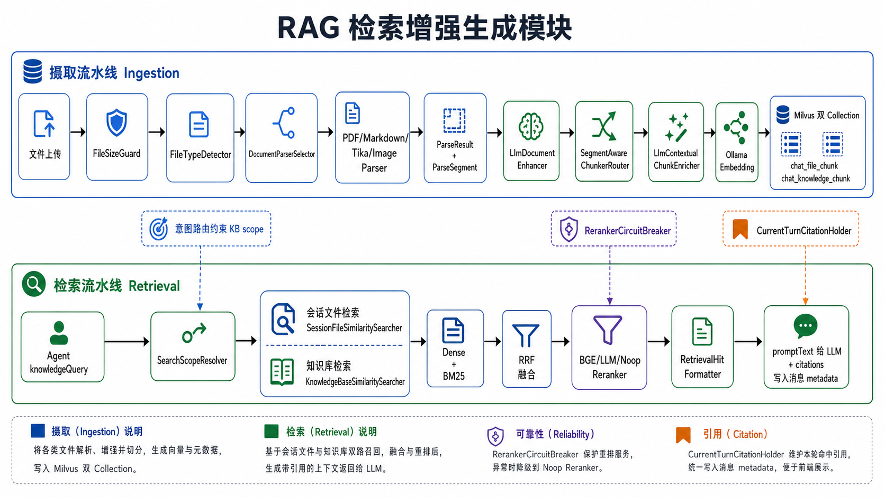

# RAG 检索增强生成模块

## 0. 模块定位

这个模块负责 ChatAgent 的知识检索增强生成，也就是把用户上传的会话文件、后台知识库文档，转成可检索的 chunk；再在 Agent 需要知识时，把相关证据检索出来，格式化成 tool response，并把引用元数据挂到最终 assistant 消息上。

它位于 `chatagent/bootstrap/src/main/java/com/yulong/chatagent/rag`，向上被 `SessionFileTools.knowledgeQuery(...)` 调用，向下连接文档存储、解析器、LLM 增强、Ollama embedding、Milvus、BM25、RRF 和 reranker。

它的职责不是：

- 不负责 Agent ReAct 循环，那是 [02-agent-runtime.md](02-agent-runtime.md)。
- 不负责判断本轮是不是 KB 意图，那是 [05-intent-routing.md](05-intent-routing.md)。
- 不负责模型首包探测和路由，那是 [01-llm-routing.md](01-llm-routing.md)。
- 不负责前端消息如何流式展示，那是 `AgentMessageBridgeImpl` 所在的 Agent runtime。

它真正负责的是：

- 会话附件摄取：上传文件 -> 解析 -> 分块 -> 向量化 -> 写入 `chat_file_chunk`。
- 知识库文档摄取：后台文档 -> 解析 -> LLM 文档增强 -> 分块 -> chunk 上下文增强 -> 写入 `chat_knowledge_chunk`。
- PDF 双轨解析：文本质量好走 PDFBox fast-track，扫描/低质量页走 VDP visual-track。
- 混合检索：dense embedding + BM25 sparse，两路结果用 RRF 融合。
- 范围控制：会话文件只查当前 session，知识库受 Agent 绑定和意图路由 scoped KB 约束。
- 重排序：BGE HTTP reranker 优先，失败后降级到 LLM/Noop，并有熔断保护。
- 引用闭环：`promptText` 给模型，`citations` 暂存到 `CurrentTurnCitationHolder`，最终消息确认后写入 metadata。

核心路径：

| 类型 | 文件 |
|---|---|
| Agent 工具入口 | `chatagent/bootstrap/src/main/java/com/yulong/chatagent/agent/tools/SessionFileTools.java` |
| RAG 应用门面 | `chatagent/bootstrap/src/main/java/com/yulong/chatagent/rag/application/RagService.java` |
| 检索范围编排 | `chatagent/bootstrap/src/main/java/com/yulong/chatagent/rag/SearchScopeResolver.java` |
| 会话文件摄取 | `chatagent/bootstrap/src/main/java/com/yulong/chatagent/rag/ingestion/FileIngestionService.java` |
| 知识库文档摄取 | `chatagent/bootstrap/src/main/java/com/yulong/chatagent/rag/ingestion/KnowledgeDocumentIngestionServiceImpl.java` |
| 文件类型检测 | `chatagent/bootstrap/src/main/java/com/yulong/chatagent/rag/parser/FileTypeDetector.java` |
| 解析器选择 | `chatagent/bootstrap/src/main/java/com/yulong/chatagent/rag/parser/DocumentParserSelector.java` |
| PDF 主解析器 | `chatagent/bootstrap/src/main/java/com/yulong/chatagent/rag/parser/PdfDocumentParser.java` |
| PDF 质量路由 | `chatagent/bootstrap/src/main/java/com/yulong/chatagent/rag/parser/PdfQualityRouter.java` |
| VDP 引擎路由 | `chatagent/bootstrap/src/main/java/com/yulong/chatagent/rag/parser/VdpEngineRouter.java` |
| 分块路由 | `chatagent/bootstrap/src/main/java/com/yulong/chatagent/rag/ingestion/SegmentAwareChunkerRouter.java` |
| 普通文本分块 | `chatagent/bootstrap/src/main/java/com/yulong/chatagent/rag/ingestion/PlainTextChunker.java` |
| Markdown 结构分块 | `chatagent/bootstrap/src/main/java/com/yulong/chatagent/rag/ingestion/StructureAwareMarkdownChunker.java` |
| 文档级增强 | `chatagent/bootstrap/src/main/java/com/yulong/chatagent/rag/ingestion/LlmDocumentEnhancer.java` |
| chunk 上下文增强 | `chatagent/bootstrap/src/main/java/com/yulong/chatagent/rag/ingestion/LlmContextualChunkEnricher.java` |
| 会话文件混合检索 | `chatagent/bootstrap/src/main/java/com/yulong/chatagent/rag/retrieve/SessionFileSimilaritySearcher.java` |
| 知识库混合检索 | `chatagent/bootstrap/src/main/java/com/yulong/chatagent/rag/retrieve/KnowledgeBaseSimilaritySearcher.java` |
| BGE 重排序 | `chatagent/bootstrap/src/main/java/com/yulong/chatagent/rag/retrieve/BgeHttpRetrievalReranker.java` |
| 重排序熔断器 | `chatagent/bootstrap/src/main/java/com/yulong/chatagent/rag/retrieve/RerankerCircuitBreaker.java` |
| 知识文档信号 | `chatagent/bootstrap/src/main/java/com/yulong/chatagent/rag/retrieve/KnowledgeDocumentSignalService.java` |
| 引用格式化 | `chatagent/bootstrap/src/main/java/com/yulong/chatagent/rag/application/RetrievalHitFormatter.java` |
| Milvus 会话文件索引 | `chatagent/bootstrap/src/main/java/com/yulong/chatagent/rag/vector/milvus/DefaultMilvusIndexService.java` |
| Milvus 知识库索引 | `chatagent/bootstrap/src/main/java/com/yulong/chatagent/rag/vector/milvus/DefaultKnowledgeBaseMilvusIndexService.java` |

一句话概括：

> RAG pipeline 是 ChatAgent 的“知识证据流水线”：摄取阶段把文档加工成可检索 chunk，检索阶段在 session/KB scope 内用 dense + BM25 找证据、RRF 融合、rerank 排序，最后把证据文本交给模型，把结构化 citations 交给消息 metadata。

---

## 图解总览（先看图，再读代码）

### 图 1：RAG 摄取与检索全景



看这张图时先抓两条主线：

- 摄取线：文件先被解析、增强、分块、向量化，最后写入 Milvus 双 collection。
- 检索线：Agent 调 `knowledgeQuery` 后，RAG 同时查会话文件和知识库，再融合、重排、格式化。

再抓三个边界：

- `IntentResolution` 只约束知识库检索范围，不会阻止当前会话附件检索。
- `RerankerCircuitBreaker` 保护的是重排序服务，重排失败不会让整轮 RAG 失败。
- `CurrentTurnCitationHolder` 存的是引用元数据，不是给模型看的证据正文。

---

## 1. 总体架构

这个模块可以按 5 条主链路理解：

1. Agent 工具链：模型调用 `SessionFileSearchTool`，后端执行 `knowledgeQuery(query)`。
2. 摄取链：文件进入 `FileIngestionService` 或 `KnowledgeDocumentIngestionServiceImpl`，被解析、增强、分块、入库和索引。
3. 解析链：`DocumentParserSelector` 根据文件类型和 pipeline source 选择 PDF、Markdown、Tika 或 Image 解析器。
4. 检索链：`SearchScopeResolver` 解析 scope，分别检索会话文件和知识库，再 RRF 融合。
5. 输出链：`RetrievalHitFormatter` 生成 `promptText + citations`，模型只看到证据文本，前端最终看到结构化引用。

### 1.1 生产主入口在哪里

生产 Agent runtime 不是直接调向量库，而是从工具开始：

```text
- AgentThinkingEngine
   -> 模型决定调用 SessionFileSearchTool
      -> SessionFileTools.knowledgeQuery(query)
         -> RagService.similaritySearchBySession(sessionId, query, intentResolution)
            -> SearchScopeResolver.searchBySession(...)
```

`SessionFileTools.knowledgeQuery(...)` 有一个很重要的安全边界：

- 模型只传 `query`。
- `sessionId` 从 `CurrentChatSessionHolder` 取。
- `turnId` 从 `CurrentTurnHolder` 取。
- `intentResolution` 从 `CurrentIntentResolutionHolder` 取。

所以模型不能通过工具参数伪造 `sessionId` 去查别人的会话文件，也不能自己绕过意图路由指定知识库范围。

### 1.2 RAG 模块的两个输入池

| 输入池 | 生命周期 | 摄取服务 | Milvus collection | 检索范围 |
|---|---|---|---|---|
| 会话附件 | 跟随 chat session | `FileIngestionService` | `chat_file_chunk` | 当前 session 已绑定文件 |
| 知识库文档 | 后台长期维护 | `KnowledgeDocumentIngestionServiceImpl` | `chat_knowledge_chunk` | Agent 绑定 KB + intent scoped KB |

这两个池子检索时会合并，但它们的权限边界不同：

- 会话文件边界来自 `chat_session_file` 关系。
- 知识库边界来自 Agent 默认绑定、知识库 active 状态和意图路由 scope。

### 1.3 为什么检索链里有多次 RRF

RRF 是 Reciprocal Rank Fusion。当前代码里有三处使用：

| 位置 | 融合对象 |
|---|---|
| `SessionFileSimilaritySearcher` | 会话文件 dense hits + BM25 hits |
| `KnowledgeBaseSimilaritySearcher` | 知识库 dense hits + BM25 hits |
| `SearchScopeResolver` | 会话文件 candidates + 知识库 candidates |

公式都是：

```text
rrfScore = 1 / (rrfK + rank + 1)
```

这里的重点是：RRF 用排名位置融合，不直接比较 dense cosine 分数和 BM25 分数。这样两类分数尺度不同也没关系。

---

## 2. 摄取流水线

> 图解：整体关系见上方 [图 1：RAG 摄取与检索全景](assets/04-rag-pipeline/01-rag-pipeline-overview.png)。

### 2.1 会话文件摄取：FileIngestionService

`FileIngestionService.ingest(...)` 是会话附件的异步摄取入口。主流程可以压缩成：

```text
initializeContext
  -> fetchSource
  -> parseDocument
  -> quality gate
  -> enhanceDocument
  -> chunkDocument
  -> enrichChunks
  -> build FileChunkDTO
  -> persistChunks
  -> markCompleted
```

关键代码阶段：

| 阶段 | 方法 | 作用 |
|---|---|---|
| 初始化 | `initializeContext(...)` | 创建 `SessionIngestionContext` |
| 读取源 | `fetchSource(...)` | 文件大小检查、读取 prefix、选择 parser |
| 解析 | `parseDocument(...)` | 得到 `ParseResult + ParseSegment` |
| 增强 | `enhanceDocument(...)` | 调 `DocumentEnhancer`，会话文件通常走 Noop 或轻量策略 |
| 分块 | `chunkDocument(...)` | 调 `DocumentChunker` |
| chunk 增强 | `enrichChunks(...)` | 调 `ChunkEnricher` |
| 持久化 | `persistChunks(...)` | DB 删除旧 chunk、保存新 chunk、Milvus upsert |
| 完成 | `markCompleted(...)` | `parseStatus = COMPLETED` |

摄取失败时不会留下半套索引：

- 解析 `OCR_REQUIRED` 会进入 OCR pending 状态。
- `QualityLevel.REJECTED` 会标记 rejected。
- 异常会 `markFailed`，并尽量清理旧 chunk 和 Milvus 索引。

### 2.2 知识库文档摄取：KnowledgeDocumentIngestionServiceImpl

知识库摄取和会话文件很像，但多了长期知识管理需要的东西：

```text
loadSource
  -> parseDocument
  -> build KnowledgeIngestionContext
  -> LlmDocumentEnhancer
  -> DocumentChunker
  -> ChunkEnricher
  -> build KnowledgeChunkDTO
  -> delete old chunks + delete old Milvus
  -> save chunks + upsert Milvus
  -> saveOrUpdate KnowledgeDocumentSignal
  -> markCompleted + SSE status
```

和会话文件相比，知识库文档有三点更重：

- 会保存文档级 `keywords/questions`，后面 `KnowledgeDocumentSignalService` 会在 rerank 前注入这些信号。
- 会发布 `KnowledgeDocumentStatusSseService` 状态更新，后台管理页面可以看到解析/索引状态。
- 失败会抛 `RetryableKnowledgeDocumentIngestionException`，便于任务重试。

### 2.3 FileSizeGuard：先挡大文件

`FileSizeGuard.guardBeforeRead(...)` 在 `readBytes()` 或 `openInputStream()` 前执行。

它的作用很朴素但很重要：

- 防止超大文件进内存导致 OOM。
- 让失败尽早发生，避免解析器和 VDP 浪费资源。
- 当前硬限制在文档里可以记成 30MB。

### 2.4 摄取上下文：为什么有 Session 和 Knowledge 两套 Context

`SessionIngestionContext` 和 `KnowledgeIngestionContext` 都继承或复用 `BaseIngestionContext` 的思路，但它们携带的业务归属不同：

| Context | 关键归属 |
|---|---|
| `SessionIngestionContext` | `sessionId`、`sessionFile`、文件扩展名、parse result |
| `KnowledgeIngestionContext` | `knowledgeBaseId`、`documentId`、文件扩展名、parse result、文档增强元数据 |

这让后续 `DocumentEnhancer`、`ChunkEnricher`、Indexer 不需要重新查询“这个 chunk 属于谁”。

---

## 3. 文档解析流水线

### 3.1 DocumentParserSelector：统一入口

解析器选择发生在 `DocumentParserSelector.selectParser(...)`：

```text
prefix + filename + mimeType + pipelineSource
  -> FileTypeDetector.detect(...)
  -> rejected type 抛 FileRejectedException
  -> 遍历 DocumentParser Bean
  -> supports(detectedFileType)
  -> 按 getSelectionPriority 排序
  -> 取第一个匹配
  -> 无匹配回退 Tika
```

`pipelineSource` 很关键：

- `SESSION`：会话附件允许图片进入 VLM 解析。
- `KNOWLEDGE`：知识库更严格，某些临时/图片/二进制类型会拒绝或进入更保守路径。

### 3.2 FileTypeDetector：不是只看扩展名

`FileTypeDetector` 综合三类信号：

| 信号 | 作用 |
|---|---|
| magic bytes / Tika 检测 | 判断真实二进制类型 |
| 文件扩展名 | 用户上传文件名提示 |
| MIME type | 浏览器或存储层声明类型 |

这样可以防止：

- `.pdf` 实际是可执行文件。
- MIME type 声明和真实内容不匹配。
- 压缩包、音视频、Excel 等不支持类型进入解析链路。

### 3.3 四类主解析器

| 解析器 | 适用文件 | 输出特点 |
|---|---|---|
| `PdfDocumentParser` | PDF | 多页 `ParseSegment`，可能混合文本页和 VDP 页 |
| `MarkdownDocumentParser` | `.md/.markdown` | 保留 Markdown 结构 |
| `TikaDocumentParser` | doc/docx/txt 等通用文本 | 清洗后的 `FULL` segment |
| `ImageDocumentParser` | 图片 | VLM 转录成 `FIGURE` segment |

所有解析器最后都要产出 `ParseResult`。后续分块层只看 `ParseSegment`，不关心原文件来自 PDF 还是 Markdown。

### 3.4 PdfDocumentParser：PDF 双轨解析

PDF 是最复杂的输入，因为它可能是：

- 原生文本 PDF。
- 扫描件。
- 文本和图片混排。
- 表格/图片/公式密集文档。

当前 PDF 解析可以理解为：

```text
PDFBox 提取页面文本
  -> TextCleanupUtil 清洗
  -> PdfQualityRouter 逐页决定 route
     -> fast-track: 直接使用文本
     -> visual-track: PdfPageRenderer 渲染页面图片
          -> PdfVdpDispatcher
             -> VdpEngineRouter
                -> VlmVdpEngine / MinerUVdpEngine / NoopVdpEngine
  -> PdfSegmentAssembler 合并 ParseSegment
```

### 3.5 VDP 引擎：视觉文档处理

VDP 是 Visual Document Processing，用来处理低质量或扫描类页面。

| 引擎 | 模式 | 典型用途 |
|---|---|---|
| `VlmVdpEngine` | `PAGE_IMAGE` | 单页图片发给视觉语言模型转录 |
| `MinerUVdpEngine` | `PDF_PAGE_BATCH` | 批量 PDF 交给外部 MinerU 服务 |
| `NoopVdpEngine` | fallback | VDP 不可用时返回降级结果 |

这里要注意：VDP 是解析兜底，不是检索兜底。它发生在摄取阶段，目的是尽量把扫描页变成文本 segment。

---

## 4. 分块与增强

### 4.1 SegmentAwareChunkerRouter：按 segment 类型选策略

`SegmentAwareChunkerRouter` 是分块入口。它不直接按文件类型分块，而是看解析后的 `SegmentType`：

| SegmentType | 策略 |
|---|---|
| `FULL` | 判断是否 Markdown，再走结构分块或普通文本分块 |
| `PAGE` | 页面合并分块，控制 target/max chars |
| `FIGURE` | 通常每个图像转录结果独立成块 |
| `TABLE / SECTION` | 合并文本后走普通文本分块 |

这层设计的好处是：PDF、Markdown、Tika 只要产出相同类型的 segment，就能复用同一套 chunk 策略。

### 4.2 PlainTextChunker：朴素但稳定

`PlainTextChunker` 做固定大小文本分块，边界优先级大致是：

```text
双换行 -> 单换行 -> 中文句号 -> 英文句号 -> 空格 -> 硬切
```

它的目标不是语义最优，而是稳定、可预测、不会把 chunk 切得太碎或太长。

### 4.3 StructureAwareMarkdownChunker：保结构

Markdown 分块先识别行类型：

- heading
- code block
- atomic block，比如图片/链接
- paragraph

再按标题层级打包。这样能尽量保证：

- 标题和正文不被拆散。
- 代码块不被切开。
- 小尾巴 chunk 合并回前一个 chunk。

### 4.4 LlmDocumentEnhancer：文档级增强

`LlmDocumentEnhancer` 主要服务知识库管道。它做的是文档级增强，而不是每个 chunk 的上下文增强。

典型输出包括：

- 增强后的 segments。
- 文档 keywords。
- 文档 questions。
- enhancer metadata。
- cache key。

这些 signals 之后会被 `KnowledgeDocumentSignalService.saveOrUpdate(...)` 保存，检索时再补回候选 hit 里，帮助 reranker 判断相关性。

### 4.5 LlmContextualChunkEnricher：chunk 上下文增强

`LlmContextualChunkEnricher` 做的是 Anthropic 风格 contextual retrieval：

```text
整个文档摘要/截断文本 + 当前 chunk
  -> LLM 生成 contextText
  -> retrievalText = contextText + chunkContent
  -> embedding / BM25 / rerank 使用 retrievalText
```

为什么要这样做？

- 单个 chunk 可能缺主语、章节背景或表格上下文。
- 加上 `contextText` 后，embedding 和 BM25 更容易匹配用户问题。
- 最终给模型时也能显示 `Chunk Context`，帮助回答更稳。

---

## 5. Milvus 双 Collection

### 5.1 两套索引服务

| Collection | 管理类 | 业务来源 |
|---|---|---|
| `chat_file_chunk` | `DefaultMilvusIndexService` | 会话附件 |
| `chat_knowledge_chunk` | `DefaultKnowledgeBaseMilvusIndexService` | 后台知识库 |

两套 collection 结构相似，但 scope 字段不同：

- 会话文件索引围绕 `sessionId/sessionFileId` 查询。
- 知识库索引围绕 `knowledgeBaseId/documentId` 查询。

### 5.2 一条 chunk 存什么

可以把 Milvus 中一条 chunk document 理解成：

| 字段 | 作用 |
|---|---|
| `chunk_id` | 主键 |
| `embedding` | dense vector |
| `bm25_text / bm25_sparse` | BM25 稀疏检索 |
| `content` | 原始 chunk 正文 |
| `context_text` | LLM 生成或解析得到的上下文 |
| `retrieval_text` | 检索用文本，通常是 context + content |
| `document_id/document_name` | 引用和回填 |
| `section_path/chunk_index` | 定位来源位置 |

### 5.3 为什么 DB 和 Milvus 都要写

DB 保存业务实体，Milvus 保存检索索引：

- DB 用于后台管理、状态、审计和重建索引。
- Milvus 用于高性能向量/稀疏搜索。

摄取时通常是“删旧再写新”：

```text
delete old DB chunks
  -> save new DB chunks
  -> delete old Milvus vectors
  -> upsert new Milvus vectors
```

这样同一个文件重新上传或重新解析时，不会混入旧 chunk。

---

## 6. 检索流程

### 6.1 SearchScopeResolver：检索编排器

`SearchScopeResolver.searchBySession(...)` 是检索阶段最重要的类。

主流程：

```text
chatSessionId + queryText + intentResolution
  -> find chatSession
  -> resolveSessionFileIds(chatSessionId)
  -> SessionFileSimilaritySearcher.searchCandidateHitsBySessionFileIds(...)
  -> resolveKnowledgeHits(chatSession, queryText, intentResolution)
  -> fuseHits(knowledgeBaseHits, sessionHits)
  -> attachKnowledgeSignalsForKnowledgeBaseHits(...)
  -> retrievalReranker.rerank(...)
  -> topK RetrievalHit
```

这里有一个容易误解的点：

> `SearchScopeResolver` 不是只查 session file。它会同时查会话附件和知识库，只是知识库会被 intent scope 约束。

### 6.2 知识库范围解析

`resolveKnowledgeHits(...)` 的逻辑可以按三种情况记：

| 情况 | 行为 |
|---|---|
| `intentResolution == null` | 查 Agent 默认绑定知识库 |
| 非 KB 意图 | 不查知识库，只保留会话文件检索 |
| KB 意图 | 先查 scoped KB；没命中且允许 fallback 时，再查 Agent 默认池中非 scoped KB |

这个设计的意图是：

- 普通聊天不要被知识库污染。
- KB 意图要优先尊重意图路由识别到的知识库范围。
- scoped KB 没结果时，是否 fallback 由 `ScopePolicy` 决定。

### 6.3 会话文件检索

`SessionFileSimilaritySearcher.searchCandidateHitsBySessionFileIds(...)`：

```text
queryText
  -> OllamaEmbeddingClient.embed(queryText)
  -> Milvus dense search by sessionFileIds
  -> Milvus BM25 search by sessionFileIds
  -> RRF fuse dense + BM25
  -> 返回 candidates
```

`searchBySessionFileIds(...)` 是较完整的便捷入口，会继续 rerank 并转成 `RetrievalHit`；但生产主链路在 `SearchScopeResolver` 中使用的是 candidate 入口，因为还要和知识库 candidates 合并。

### 6.4 知识库检索

`KnowledgeBaseSimilaritySearcher.searchCandidateHitsByKnowledgeBaseIds(...)` 和会话文件检索模式一致：

```text
queryText
  -> embedding
  -> dense search by knowledgeBaseIds
  -> BM25 search by knowledgeBaseIds
  -> RRF fuse
  -> 返回 candidates
```

不同之处在于：

- 知识库候选后面会补 `KnowledgeDocumentSignal`。
- 知识库检索必须先经过 active KB 过滤。
- scope 由 Agent 绑定和 intent scoped KB 共同决定。

### 6.5 跨来源融合

`SearchScopeResolver.fuseHits(...)` 会把两路 candidates 放进同一个 map：

```text
addHitsByRrf(KNOWLEDGE_BASE, knowledgeBaseHits)
addHitsByRrf(SESSION_FILE, sessionHits)
sort by fused score desc
```

注意它的 key 包含 `sourceType/sourceId/documentId/chunkIndex/sectionPath`。这避免会话文件和知识库里同名文档被误合并。

### 6.6 topK 是最终证据数量，不是召回数量

当前默认配置里常见两个 K：

| 配置 | 含义 |
|---|---|
| `rag.retrieval.candidate-k` | Milvus dense/BM25 各自召回候选数量 |
| `rag.retrieval.top-k` | rerank 后最终给模型的证据数量 |

也就是说，`topK=3` 不表示只从 Milvus 查 3 条。通常会先召回更多候选，再融合、重排，最后截断。

---

## 7. 重排序与降级

### 7.1 RetrievalReranker 抽象

重排序实现有三类：

| 实现 | 作用 |
|---|---|
| `BgeHttpRetrievalReranker` | 首选，通过外部 BGE rerank 服务打分 |
| `LlmRetrievalReranker` | 降级，用 LLM 对候选排序 |
| `NoopRetrievalReranker` | 最终兜底，保持 RRF 顺序 |

主链路中调用的是 `RetrievalReranker.rerank(queryText, candidates)`，上层不关心具体是谁完成重排。

### 7.2 BgeHttpRetrievalReranker 的保护策略

BGE reranker 是外部 HTTP 服务，所以它有几层保护：

- `RerankerCircuitBreaker`：失败率过高进入 OPEN，直接跳过外部请求。
- HALF_OPEN readiness probe：半开时先探活。
- retry：请求失败可重试。
- fallback 标记：失败时返回原候选顺序，并标记 `scoreType="fallback"`。
- 专用连接池：避免 reranker 慢请求拖垮主 HTTP 资源。

这意味着 reranker 失败不会让 `knowledgeQuery` 抛异常。最坏情况是：

```text
Milvus candidates
  -> RRF 顺序保留
  -> scoreType=fallback
  -> RetrievalHitFormatter 仍然能生成证据
```

### 7.3 置信度过滤

BGE rerank 后如果 top score 太低，会进入 filtered 语义。

`RetrievalHitFormatter` 对 `scoreType="filtered"` 的处理是：

- 不把该命中放进 promptText。
- 结构化 citations 可能保留在内部结果中。
- 如果所有命中都 filtered，则返回 “No relevant attached session-file content found.”，并不给模型不可靠证据。

这个设计比直接返回低质量证据更安全：模型宁可说没找到，也不要根据弱相关 chunk 编答案。

---

## 8. 引用闭环

### 8.1 RetrievalHitFormatter：双输出

`RetrievalHitFormatter.formatWithCitations(...)` 返回：

```java
FormattedRetrievalPrompt(
    String promptText,
    List<CitationMetadata> citations
)
```

两者职责不同：

| 输出 | 去向 | 用途 |
|---|---|---|
| `promptText` | tool response | 给 LLM 阅读的证据块 |
| `citations` | `CurrentTurnCitationHolder` | 最终 assistant message metadata |

### 8.2 promptText 长什么样

每个命中会被格式化成稳定编号：

```text
[1] Source: xxx.pdf [SESSION_FILE] chunk 0
Section: chunk[0]
Chunk Context:
...
Chunk Content:
...
```

然后模板 `RAG_EVIDENCE_BLOCK` 会追加引用规则，提醒模型回答时使用实际出现的 `[n]`。

### 8.3 citations 什么时候写入消息

`SessionFileTools.knowledgeQuery(...)` 里只是：

```text
currentTurnCitationHolder.put(sessionId, turnId, formatted.citations())
```

真正写入 assistant 消息 metadata 的时机在 Agent runtime：

- `streamFinalResponse`：最终回答一定保留，所以可以 `take` citations。
- `streamDecisionResponse`：先 `peek`，如果没有 tool call、临时 assistant 升级为最终回答，才 `take`。
- 如果决策流最后产生 tool call，临时 assistant 会 rollback，citations 不应被提前消费。

所以 citations 不是“工具一执行就展示”，而是“最终回答确认保留后再绑定”。

---

## 9. 和 Agent Runtime 的接缝

### 9.1 knowledgeQuery 是 RAG 和 Agent 的交界点

`knowledgeQuery(query)` 做 5 件事：

1. 从 Holder 取 `sessionId/turnId/intentResolution`。
2. 调 `ragService.similaritySearchBySession(...)`。
3. 用 `CurrentTurnKnowledgeHitHolder.recordRetrievalResult(...)` 记录本轮是否检索命中。
4. 用 `RetrievalHitFormatter.formatWithCitations(...)` 生成证据文本和引用元数据。
5. 把 citations 放进 `CurrentTurnCitationHolder`，返回 `promptText` 给模型。

它返回的是 tool response，不是直接给用户看的最终回答。

### 9.2 knowledgeHit 的语义

`CurrentTurnKnowledgeHitHolder` 记录的是：

> 本轮是否尝试过知识检索，以及检索是否命中。

这和“最终回答是否采用知识”不是一回事。

常见语义：

- 没有调用 RAG 工具：默认不把它当成知识缺失。
- 调用了 RAG 工具且返回空：`knowledgeHit = false`。
- 多次调用只要有一次命中：`knowledgeHit = true`。

### 9.3 为什么非 KB 意图仍然可能查会话文件

`SearchScopeResolver` 对非 KB 意图只关闭知识库检索：

```text
非 KB 意图
  -> knowledgeBaseHits = []
  -> sessionHits 仍然按当前 session 文件检索
```

原因是会话附件通常是用户当前对话上下文的一部分，而知识库是长期全局知识源。前者可以作为局部上下文，后者需要更严格的意图边界。

---

## 10. 配置速览

RAG 相关配置分散在 `application.yaml` 的 `rag.*` 下，常见维度包括：

| 配置方向 | 典型字段 |
|---|---|
| 检索数量 | `rag.retrieval.top-k`、`rag.retrieval.candidate-k`、`rag.retrieval.rrf-k` |
| Milvus | collection 名、向量维度、索引参数、BM25 analyzer |
| Embedding | Ollama base URL、模型名、维度 |
| Reranker | BGE endpoint、模型名、timeout、score threshold、熔断参数 |
| 文档增强 | 是否启用、短文档阈值、LLM 提示词/缓存 |
| chunk 增强 | 是否启用、最大文档字符数、并发/超时 |
| VDP | VLM/MinerU/Noop 路由、缓存、DPI、批量策略 |

读配置时要区分：

- candidate-k 控召回池大小。
- top-k 控最终给模型的证据条数。
- reranker threshold 控低置信证据是否进入 prompt。
- VDP 配置只影响摄取，不影响已经入库的 chunk 检索。

---

## 11. 当前生产路径里哪些代码最重要

如果你只看主线，推荐按这个顺序读：

1. `SessionFileTools.knowledgeQuery(...)`
2. `RagService.similaritySearchBySession(...)`
3. `SearchScopeResolver.searchBySession(...)`
4. `SearchScopeResolver.resolveKnowledgeHits(...)`
5. `SessionFileSimilaritySearcher.searchCandidateHitsBySessionFileIds(...)`
6. `KnowledgeBaseSimilaritySearcher.searchCandidateHitsByKnowledgeBaseIds(...)`
7. `SearchScopeResolver.fuseHits(...)` 和 `rerankAndLimit(...)`
8. `BgeHttpRetrievalReranker.rerank(...)`
9. `RetrievalHitFormatter.formatWithCitations(...)`
10. `CurrentTurnCitationHolder` 在 `AgentMessageBridgeImpl` 里的消费逻辑

摄取链建议另起一轮读：

1. `FileIngestionService.ingest(...)`
2. `KnowledgeDocumentIngestionServiceImpl.ingestSync(...)`
3. `DocumentParserSelector.selectParser(...)`
4. `FileTypeDetector.detect(...)`
5. `PdfDocumentParser.parse(...)`
6. `PdfQualityRouter`
7. `VdpEngineRouter`
8. `SegmentAwareChunkerRouter.chunk(...)`
9. `LlmDocumentEnhancer.enhance(...)`
10. `LlmContextualChunkEnricher.enrich(...)`
11. `SessionFileMilvusIndexer` / `KnowledgeBaseMilvusIndexer`

---

## 12. 常见易混点

### 12.1 `RagService` 和 `SearchScopeResolver` 谁更核心

`RagService` 是门面，方便 Agent 工具依赖一个稳定入口。

真正决定“查哪里、怎么融合、怎么 rerank”的是 `SearchScopeResolver`。

### 12.2 `searchBySessionFileIds` 和 `searchCandidateHitsBySessionFileIds` 区别

- `searchBySessionFileIds(...)`：完整搜索，自己 rerank 后返回 `RetrievalHit`。
- `searchCandidateHitsBySessionFileIds(...)`：只返回 dense + BM25 + RRF 后的 Milvus candidates。

生产主链路用 candidate 入口，因为还要跟知识库候选合并后统一 rerank。

### 12.3 `content/contextText/retrievalText` 的区别

| 字段 | 作用 |
|---|---|
| `content` | 原始 chunk 正文，最终证据主体 |
| `contextText` | chunk 的上下文说明 |
| `retrievalText` | 检索用文本，通常拼了 context 和 content |

如果 `content` 为空，部分转换逻辑会退回使用 `retrievalText`。

### 12.4 `promptText` 和 `citations` 不要混

- `promptText` 给模型看。
- `citations` 给前端/数据库看。

模型回答里的 `[1]` 要和 `citations[0]` 对齐，所以 `RetrievalHitFormatter` 必须稳定编号。

### 12.5 filtered 和 fallback 不是一回事

| scoreType | 含义 |
|---|---|
| `filtered` | reranker 判断置信度低，不进入 prompt |
| `fallback` | reranker 不可用或失败，保留 RRF 顺序 |
| `retrieval` | 没有 reranker 分数，使用检索阶段分数 |
| `reranker` | 使用 reranker 结果 |

filtered 是“不要给模型看”；fallback 是“服务降级但仍可用”。

### 12.6 VDP 和 Reranker 都有降级，但位置不同

- VDP 降级发生在摄取阶段：解析 PDF/图片时用。
- Reranker 降级发生在检索阶段：候选已经召回后用。

不要把这两个故障域混在一起。

### 12.7 知识库 signals 是辅助重排，不是直接证据

`KnowledgeDocumentSignalService` 保存的是文档级 keywords/questions。

它们用于帮助 reranker 理解候选文档，但最终 evidence block 还是来自 chunk 的 `content/contextText`。

---

## 13. 一句话总复习

> RAG pipeline 的主心智模型是“两段式”：摄取阶段把不同格式文档统一成带上下文的 chunk 并写入 Milvus；检索阶段在当前 session 和意图允许的 KB 范围内召回 dense/BM25 候选，RRF 融合、rerank 排序，再把 `promptText` 交给模型、把 `citations` 交给最终消息。
