## SC6109 Blockchain Privacy & Scalability

Lecture 05

Assoc Prof Guo Jian SPMS

## Post-Quantum Cryptography and Its Impact on Blockchain and Cryptocurrency

## Development of Quantum Computers

## A Roadmap of Quantum Computing

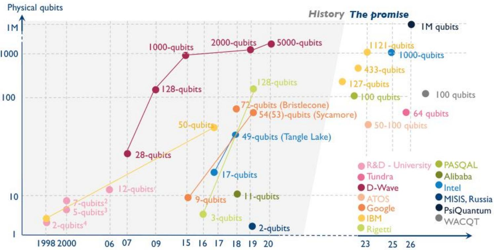  
source: https://www.yolegroup.com/product/report/quantum-technologies-2021/

## Disruption of Public-Key Cryptography

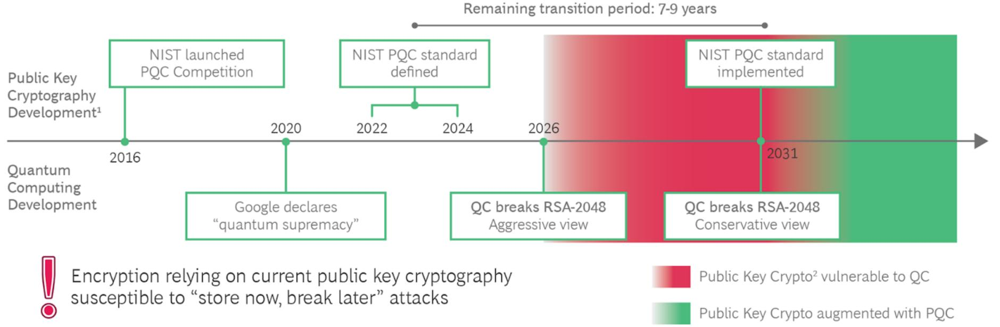

## NIST Post-Quantum Cryptography (PQC) Standardization Process

## ROUND 012016

·Dec 2016 - Jan 2019

· 82 submissions

· 69 valid candidates

26 selected candidates

Identifying strengths and weakness

## ROUND 02

2019

·Jan 2019 - Jul 2020

· 26 candidates

· 7 selected

· 8 alternate

Evaluating of software and hardware implementations

## ROUND 03

2020

·Jul 2020 - Nov 2022

· 7 candidates

· 4 PKE/KEM

· 3 signatures

· 1 PKE/KEM selected

· 3 signatures selected

· 4 candidates to the 4th round

## ROUND 04

2022

· Nov 2022 - present

· 4 PKE/KEM candidates

· SiKE published attacks

· BIKE

· Classic McEliece

· HQC

## Generalized Moore’s Law Applied to AES

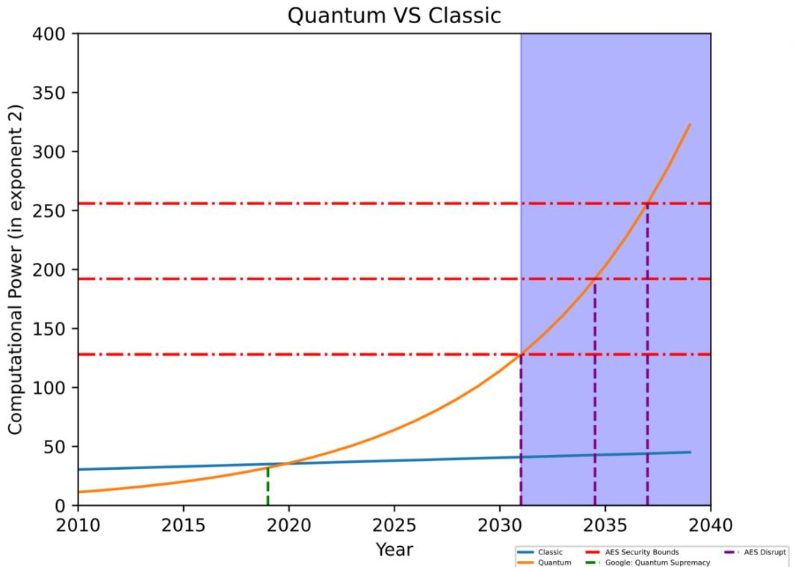

## Assumptions taken:

The growth of the qubit follows a generalized Moore’s Law (Based on current statistics, qubits doubles every 6 years)

The computational power of n qubits is generally equivalent to 2n classical bits

All versions of AES will be broken in 15 years !

## Meet The Quantum Adversaries

## Grover’s Search

– Quadratic speedup on bruteforce search of preimage: 2n

– Speedup on collision finding: 2n/2 2n/3

Example: for hash function standard AES-MMO, a quantum computer can find a preimage in 264 computations instead of 2128 and a collision in 243 computations instead of 264

## Simon’s Period Finding

Linearized time for finding period behaviors, i.e., if f(x) = f(x+s) for all x, then finding the period s is easy by quantum computer

– Break MAC standards (CBC-MAC, PMAC, GMAC, etc.)

## Quantum Fourier Transform

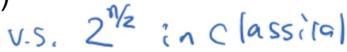

– An efficient quantum alternative for Fast Fourier Transform

– Accelerate key recovery attacks

## Example: Grover’s Algorithm

## Unstructured Search Problem

Find a qualified element in a large and unstructured database (no sorting allowed)

• Best Classic Algorithm

Brute-force traverse the database O(N)

Quantum Circuit Design of Grover’s Algorithm O(N1/2)

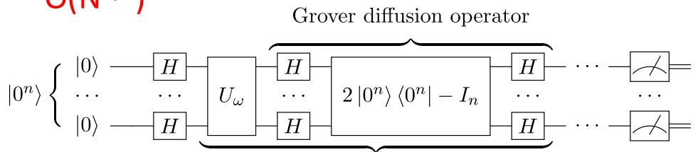  
Repeat \~ √N times

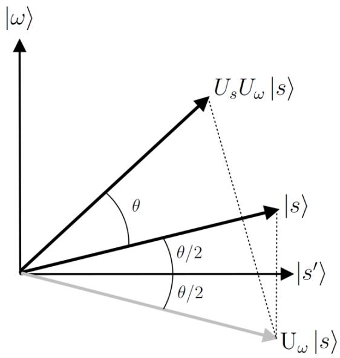  
“Amplitude Amplification”

## Modes of Operations of Block Ciphers

• Definition: The repetition mode a cipher adopts on single-block operations

Common modes:

• Electronic Codebook (ECB)

• Cipher Block Chaining (CBC)

• Counter (CTR)

## Example: CBC Mode

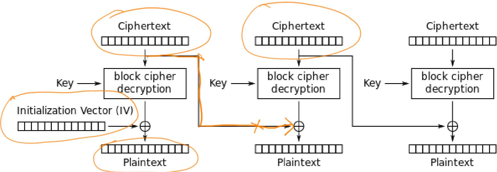  
Cipher Block Chaining (CBC) mode decryption

## Example: CFB Mode

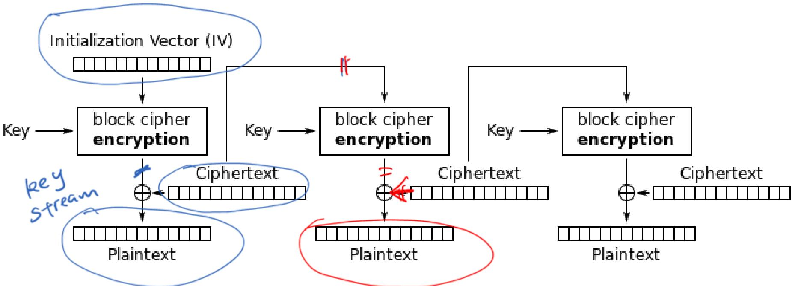  
Cipher Feedback (CFB) mode decryption

## Example: CTR Mode

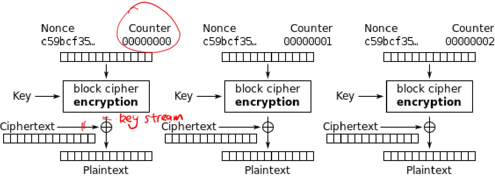  
Counter (CTR) mode decryption

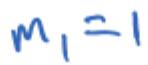

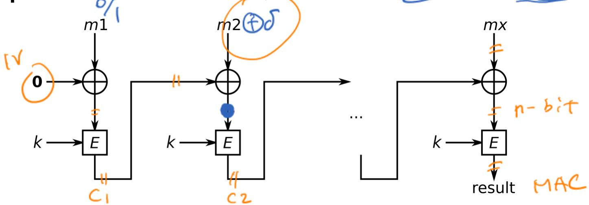

• Forgery Attack on MAC

Given access to a MAC oracle, forge a valid message/tag pair

• Classical Security of CBC-MAC Against Forgery Attacks:

If a CBC-MAC is built on a secure block cipher, forgery attacks work in 2n/2

## Example: Quantum Forgery on CBC-MAC

## Period Finding Problem

Given a function ?? that is periodic, i.e., ?? ?? ⊕ ?? = ??(??) for all x, to find the period ??

Best Classic Algorithm: O(N1/2)

## • A Glimpse on Quantum Forgery Based on Period Finding

If a ?? is found, then based on a message ?? = ?? ?? … , and its tag ??,

We can forge a m tag ??

By Simon’s Algori O( log(N) )

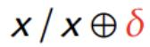

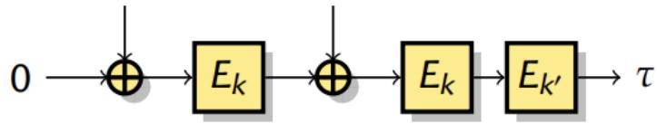

and with the same

inear time,

## Quantum Threats To Security Guarantees

## Red Zone

Completely broken under quantum attacks, quantum-resistant alternatives are in urgent need

– Modes of operations of block ciphers (CBC-MAC, PMAC, GMAC, etc.)

– Collision of Hash with digest size < 160 bits, AES-MMO

## Yellow Zone

53-b coi²sion Res^stane

Quantum computers are able to attack a reduced-round symmetric-key primitive, and the general security bound has been reduced exponentially

– Preimage security, e.g., MMO-AES128 64-b

– Collision security, SHAKE128 (Part of SHA-3)

– Key recovery security, AES-128

New block cipher designs with larger block size / digest size are needed. Modes need to be re-designed immediately !

## Quantum Algorithm to the Order

The problem: given a, N with gcd(a,N)=1, find the smallest integer r, such that ar =1 mod N

Algorithm: let f(x) = a^x mod N, then f(x) is a periodic function with period r, and this can be done in polynomial time.

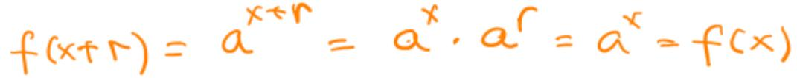

## Classic Factoring Algorithm

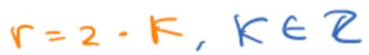

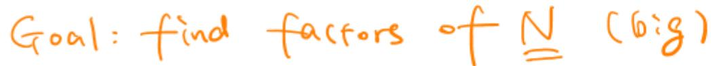

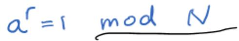

1. Pick a random number 1<α<N.

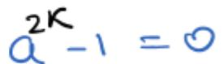

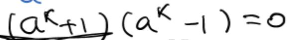

2. Compute K = gcd(a, N),the greatest common divisor of d and N.

3. If K /1, then K is a nontrivial factor of N,with the other factor being NK and we are done.

4. Otherwise,use the quantum subroutine to find the order r of a.）af= （ mod N

5. If r is odd,then go back to step 1.

6.Compute gN/1). ris g ,and we're done. Otherwise, go back to step 1.

## Quantum Algorithm for Discrete Log =12，

The problem: Given a, N and generator g for ZN\*, and y, find x, such that ax = y mod N.

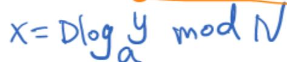

Algorithm: construct f(x1, x2) = gx1 yx2 mod N, find the period (s1, s2) of the function by quantum algorithm, then x = (- s1)s2-1 mod (phi(N))

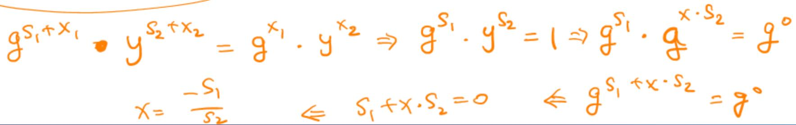

## Outline: Post-Quantum Cryptography

## I. Alternative hard problems

Lattices

Multivariate Quadratic Problems

One-way Hash functions

## II. PQC Standards

NIST PQC Standardization Process

Signatures: CRYSTALS-Dilithium, SPHINCS+

KEM: CRYSTALS-Kyber

## Meet The Quantum Adversaries

## Grover’s Search

– Quadratic speedup on bruteforce search of preimage: 2n

– Speedup on collision finding: 2n/2 2n/3

Example: for hash function standard AES-MMO, a quantum computer can find a preimage in 264 computations instead of 2128 and a collision in 243 computations instead of 264

## Simon’s Period Finding

Linearized time for finding period behaviors, i.e., if f(x) = f(x+s) for all x, then finding the period s is easy by quantum computer

– Break MAC standards (CBC-MAC, PMAC, GMAC, etc.)

## Quantum Fourier Transform

– An efficient quantum alternative for Fast Fourier Transform

– Accelerate key recovery attacks

## Post-Quantum Cipher (PQC)

## Threats on Symmetric-key Ciphers

• Grover’s search provides a quadratic speedup on unstructured search

• Needs key length at least 256 bits

• AES128/192 are vulnerable

• The post quantum cipher discussed later focuses on asymmetric-key ciphers

## Post Quantum Cipher

Ciphers based on the hardness of factoring or discrete logarithm are vulnerable to quantum adversaries

• Post Quantum Cipher (PQC) is designed based on alternative hard math problems

– Lattice based encryptions and signatures: security relies on hardness of finding short vectors in some lattices.

Coding based encryptions: security relies on hardness of decoding error-correcting codes.

– Multivariate Quadratic signatures: Security relies on hardness of solving systems of multivariate equations over finite fields.

Hash-based signature: require only a secure hash function (hard to find second preimages).

Intuition to Lattices: An Easy Problem

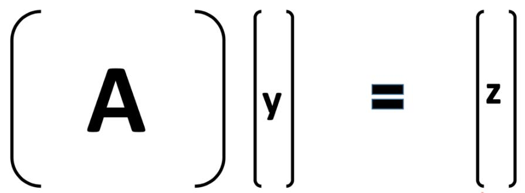

mod p

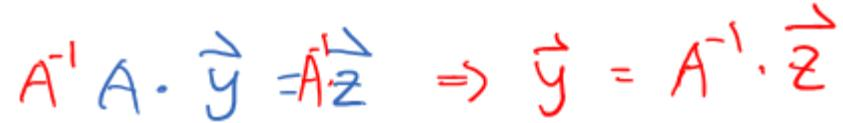

Given (A, z) and p, find y

• Solution: compute the inverse of A then multiply z

## Hard Alternative

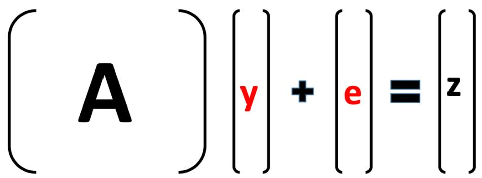

mod p

Entries of y and e are small in magnitude to enforce uniqueness

• Given (A, z) and p, find (y, e) with a small magnitude

• Hard to solve!

## Lattice Problem

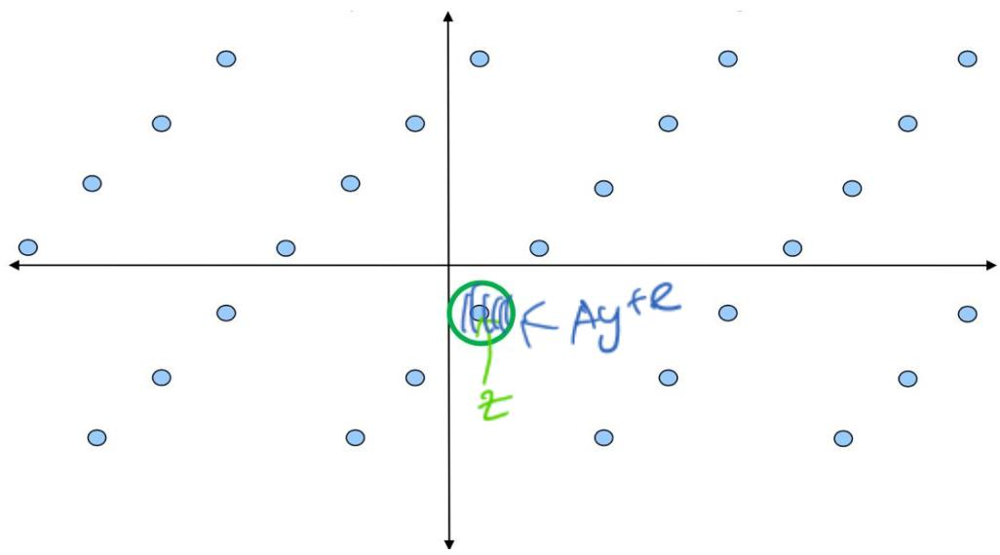

• The solution space of Ay+e=z (mod p) forms a lattice

• Lattice problem: find the point closest to the origin (Short Vector Problem SVP)

## Multivariate Quadratic (MQ)

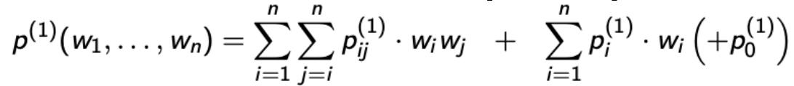

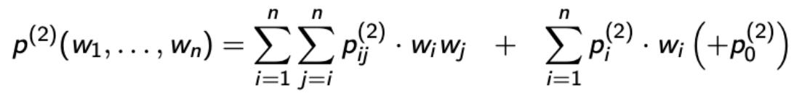

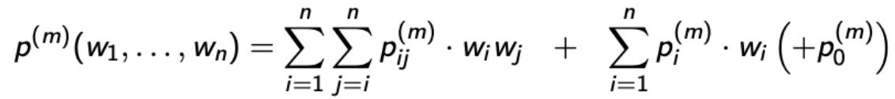

• They consists of quadratic terms wiwj and linear terms wi defined over modulo 2

Each variable w can be 0 or 1

• These discrete equations are hard to solve (unlike their counterpart on real numbers)

## Security

The security of multivariate schemes is based on the MQ problem:

Problem MQ: Given m multivariate quadratic polynomials p(1),.., p(m), find a vector w = (w1,.., Wn) such that p(1)(w)= ...= p(m)(w)= 0.

Classic: NP hard

Quantum: Hard on average

## Hash-based Signatures

• Security relies only on the security of cryptographic hash function

What we know so far:

– Preimage Resistance: reduced from 2n to 2n/2 SHA-2

– Collision Resistance: reduced from 2n/2 to 2n/3

Hence, hash functions are still considered secure when n is large enough, e.g., SHA-384, SHA-512, SHA3-384, and SHA3-512. 38 128

• Hence, no plan for new hash function schemes to resist quantum adversaries.

## Post-Quantum Cryptography Standards

## NIST PQC Standardization Process

## Security Criteria

Secure against both classical and quantum attacks
<table><tr><td>Level</td><td colspan="3"> Security Description</td></tr><tr><td></td><td> At least as hard to break as AES128 (exhaustive key search)</td><td></td><td>64-bit</td></tr><tr><td>I</td><td> At least as hard to break as SHA256 (collsion search)</td><td></td><td>85–b²</td></tr><tr><td>川I</td><td> At least as hard to break as AES192 (exhaustive key search)</td><td></td><td>q6-bit</td></tr><tr><td>IV</td><td> At least as hard to break as SHA384  (collsion search)</td><td></td><td>128-b}t</td></tr><tr><td></td><td> At least as hard to break as AES256 (exhaustive key search)</td><td></td><td>12δ-b}t</td></tr></table>

## 3rd Round Selection for Standardization

KEM

– CRYSTALS-Kyber

## Signatures

– CRYSTALS-Dilithium

– Falcon

– SPHINCS+

## CRYSTALS-Dilithium

Recommended by NIST as the PRIMARY SIGNATURE ALGORITHM USED

Public key size 1.5 KB, signature size 2.7 KB

Design based on “Fiat-Shamir with Aborts” technique

Rejection sampling is used to sample signatures that do not reveal secret information

• Signature compression (> 50% smaller)

New: Compression of public key (60% smaller, 100 byte larger signature)

• New: Hardness based on Module-LWE/SIS

New: Very efficient implementation

## Main Operations

• Evaluations of SHAKE256 (can use another XOF too) – Independent sampling of polynomials: Allows for parallel use of SHAKE

• Operations in the polynomial ring R = (????[??])/??256 + 1

– The ring with form (????[??])/???? + 1, for a prime p and dimension n, has been the most widely-used ring in the literature

Dimension n is chosen as 256, which is large enough to efficiently encrypt 256-bit keys and to a good security bound

– Prime p is chosen as: 223-213+1

Both operations are very efficient!

## Signatures with Uniform Sampling (SUS)

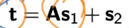

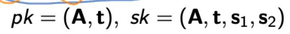

Public key: A, t

Secret key: s1, s2

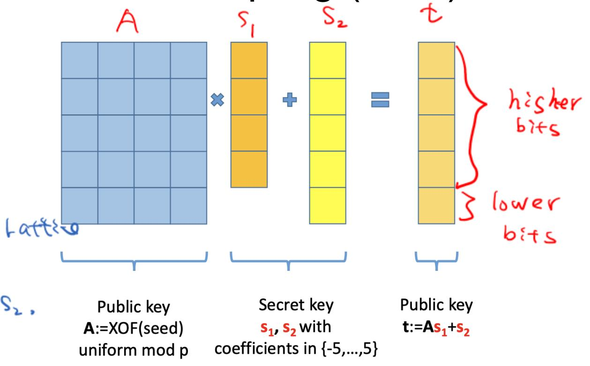

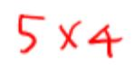

## SUS - Signing and Verification

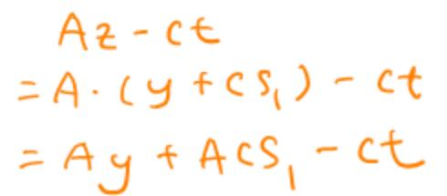

Signing:  
y←s4  
w= Ay  
= H(High(w), M) ∈B60  
z =y+cs1)  
If zl >γ- β or ‖|Low(w- cs2)| >γ- β， restart  
sig=(z,c） （2ll≤r-βand

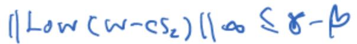

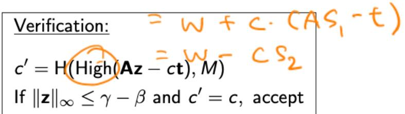

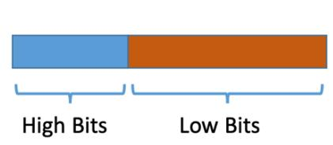

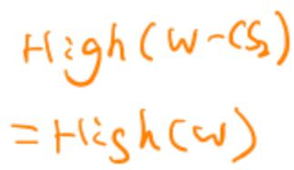

• Function high/low takes the high/low bits for a bitstring

• H stands for a hash function

• M stands for the message

## SUS – Some Properties

If /zllα >γ- β or ‖/Low(w- cs2)|α > γ- β,restart

• The check is needed for security

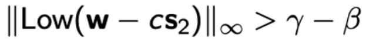

• This check is needed for correctness

• ?? = max(|cs2|), when |low(Ay – cs2)| <= ?? − ??, high(Ay - cs2) = high(Ay)

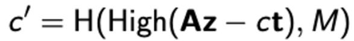

• We have Az – ct = Ay – cs2

## Dilithium: Public Key Compression As1+S2 t +bt1 0

• Replace t in public key by t1 (23 bits to 9 bits)

• In verification, we still need to compute high(Az – ct), but with key compression we can only compute high(Az – cbt1)

• Dilithium includes a carry hint vector h in the signature to correct high(Az – cbt1) to high(Az – ct)

• The hint h adds 100-200 bytes to the signature, while saves approximately 2KB in the public key

## The Carry Hint Vector

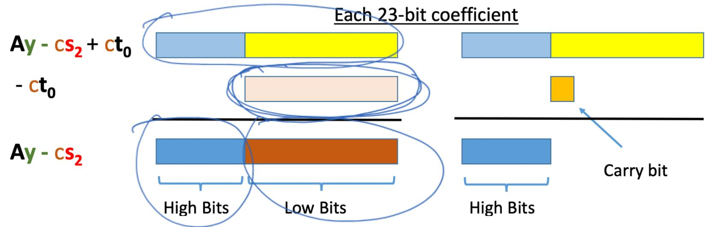

• By including the carry bit hint vector into the signature, we can successfully recover high(Az – ct) from high(Az – cbt1).

## SPHINCS+

• An advanced version of SPHINCS (Eurocrypt 2015)

• Mainly reduce the signature size of SPHINCS

• A stateless hash-based signature scheme

– What is hash-based signature scheme?

– What does stateless mean?

– What is SPHINCS?

– What does SPHINCS+ improve?

## What is hash-based signature scheme?

1979 Lamport one-time signature scheme.

• Fix a k-bit one-way function ?? ∶ 0, 1 ?? → 0, 1 ?? and hash function ?? ∶ 0, 1 ∗ → 0, 1 ?? .

Signer’s secret key ??: 2?? strings ??1 0 , ??1 1 , . . . , ???? 0 , ???? 1 , each ?? bits. Total: 2??2 bits.

Signer’s public key ?? : 2?? strings ??1[0], ??1[1], . . . , ????[0], ????[1], each ?? bits, computed as ????[??] = ??(???? [??]). Total: 2??2 bits.

Signature ??(??, ??, ??) of a message ??: ??, ??1[ℎ1], . . . , ????[ℎ??] where ??(??, ??) = (ℎ1, . . . , ℎ?? ).

Must never use secret key more than once.

• Usually choose ?? = ?? (restricted to ?? bits).

• 1979 Merkle extends to more signatures.

## What is hash-based signature scheme?

• Eight Lamport one-time keys

??1, ??2, . . . , ??8 with corresponding ??1, ??2, . . . , ??8,

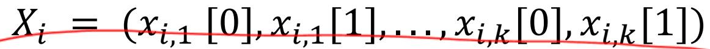

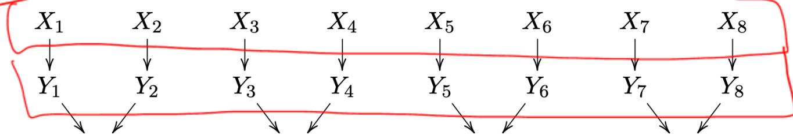

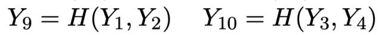

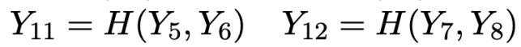

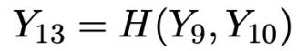

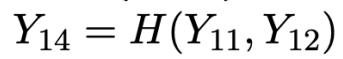

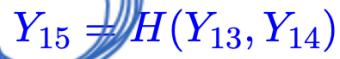

The Merkle public key is Y15.

What is hash-based signature scheme?

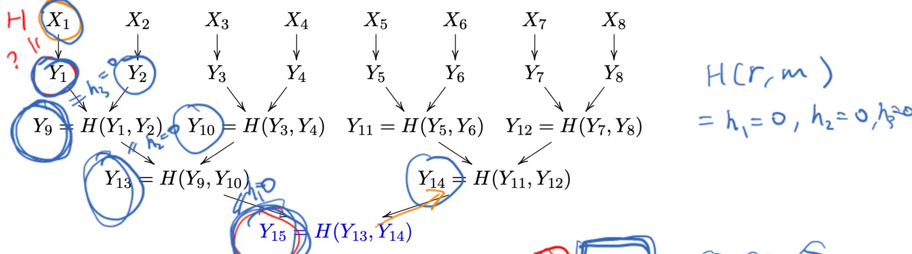

• First message has signature is ?? ??1, ??, ?? , ??1, ??2, ??10, ??14 .

• Verify: Check signature ?? ??1, ??, ?? on ?? against ??1

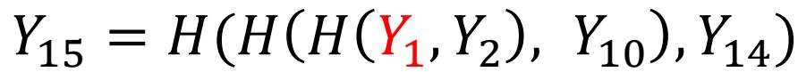

## What is hash-based signature scheme?

## Pros:

– Post quantum

– Only need secure hash function

– Small public key

– Security well understood

– Fast

## Cons:

– Biggish signature and secret key

## Stateful

## Become Stateless

• Use Huge Tree to avoid collision

• Signer chooses random ?? ∈ {2255 , 2255 + 1 . . . , 2256 − 1}

• Uses one-time public key ???? to sign message

• Uses one-time public key ???? to sign (??2?? , ??2??+1) for ?? < 2255

• Generates i-th secret key as ????(??) where ?? is master secret.

## Become Stateless

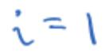

## Become Stateless

## Problem:

– Signatures are painfully long

## Examples:

Debian operating system is designed for frequent upgrades. At least one new signature for each upgrade. Typical upgrade: one package or just a few packages. 1.2 MB average package size. 0.08 MB median package size.

– HTTPS typically sends multiple signatures per page. 1.8 MB average web page in Alexa Top 1000000

## SPHINCS-256

Greatly reduce size

– 0.041 MB signature

– 0.001 MB public key

– 0.001 MB private key

## Good Speed

– 51.1 million cycles to sign. (RSA-3072: 14.2 million.)

– 1.5 million cycles to verify. (RSA-3072: 0.1 million.)

– 3.2 million cycles for keygen. (RSA-3072: 950 million.)

• Designed for 2128 post-quantum security

## SPHINCS-256

## Main improvement

– Select index pseudorandomly

– Use a few-time signature key-pair on leaves to si

• Few index collisions allowed

• Allows to reduce tree height

– Use hypertree: then d << h

## SPHINCS+

## Further reduce size

## Changes

– Allow for 264 instead of 250 signatures per key pair

– Add multi-target attack mitigation (Tweakable hash functions)

– Tree-less WOTS+ public key compression

– New few-time signature scheme FORS

– Verifiable index selection

– Optional non-deterministic signatures

– Simple instantiations with SHAKE256, SHA-256, Haraka https://sphincs.org/

## SPHINCS+

Further reduce size

## • New features

– Multi-target attack protection

– Tree-less WOTS+ public key compression

– FORS

– Verifiable index selection

https://sphincs.org/

## CRYSTALS-Kyber

Construct based on Module-LWE(Learning With Errors) Problems. This is a problem in lattice cryptography where given a random linear equation with some small error(centered binomial noise), it's hard to solve for the unknowns.

Key Encapsulation Mechanism (KEM): In Kyber, a KEM is used to secure the transmission of keys. A sender encapsulates a key into a ciphertext using the recipient's public key, and the recipient decapsulates it back into the original key using their private key.

CRYSTALS-Kyber is fast
<table><tr><td rowspan="6">cpu reg‘ster 64-b² (28-h&lt;+ AVX</td><td colspan="2">Kyber512 (k = 2, level 1)</td><td></td><td></td></tr><tr><td colspan="2">Sizes (in Bytes)</td><td>Haswell Cycles</td><td>(AVx2) cycles</td></tr><tr><td>sk:</td><td>1632</td><td>gen:</td><td>29100</td></tr><tr><td>pk:</td><td>800</td><td>enc:</td><td>46196</td></tr><tr><td>ct:</td><td>736</td><td>dec:</td><td>39410</td></tr><tr><td>Kyber768 (k = 3, level 3)</td><td></td><td></td><td></td></tr><tr><td colspan="3">bit Sizes (in Bytes) 256- AVX2</td><td></td><td></td></tr><tr><td colspan="2">512-b5k: A VX512</td><td>2400</td><td>Haswell Cycles (AVX2) gen:</td><td>57340</td></tr><tr><td colspan="2">pk:</td><td>1184</td><td>enc:</td><td>78692</td></tr><tr><td colspan="2">ct:</td><td>1088</td><td>dec:</td><td>68620</td></tr><tr><td colspan="2">Kyber1024 (k = 4, level 5)</td><td></td><td></td><td></td></tr><tr><td colspan="2"> Sizes (in Bytes)</td><td></td><td>Haswell Cycles (AVX2)</td><td></td></tr><tr><td colspan="2">sk:</td><td>3168</td><td>gen:</td><td>81244</td></tr><tr><td colspan="2">pk:</td><td>1568</td><td>enc:</td><td>109584</td></tr><tr><td colspan="2">ct:</td><td>1568</td><td>dec:</td><td>97280</td></tr></table>

## CRYSTALS-Kyber is fast and small

<table><tr><td>Kyber512 (k = 2, level 1) Stack usage (in Bytes) gen: enc: dec: 2560</td><td>2952 gen: 2552 enc: dec:</td><td>Cortex-M4 Cycles 513992 652470</td></tr><tr><td>Kyber768 (k = 3, level 3) Stack usage (in Bytes) gen: enc:</td><td>3848 gen: 3128</td><td>620946 Cortex-M4 Cycles 976205 1146021</td></tr><tr><td>dec: Kyber1024 (k = 4, level 5)</td><td>3072</td><td>enc: dec: 1094314</td></tr><tr><td>Stack usage (in Bytes) gen: enc: 3584</td><td>4360 gen:</td><td>Cortex-M4 Cycles 1574351</td></tr></table>