SC6109 一 Blockchain Privacy & Scalability

Lecture 01 一 Introduction to Privacy Issues

Assoc Prof Guo Jian SPMS

## Blockchain Technology

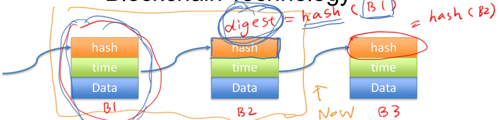

· A blockchain is'a distributed ledger with growing list of records that are securely linked together via cryptographic hashes.

·Each block contains a cryptographic hash of the previous block, a timestamp, and transaction data

·Blockchains are typically managed by a peer-to-peer (P2P) network, where nodes collectively adhere to a consensus protocol

·Bitcoin (and other cryptocurrencies) is an application of blockchain technology

A norma( cpu 290in ady

## Cryptography Involved

. Group signature

. Ring signature

Mαngev doess^t exist in r'ng sisaature.

## Hash Function

bro ken

{n2005

Wang Xiaoyun

SHA-2 :

2007→205

The basic Secuvity reguirement5. H:{0({0,²  
Qlli sionResistance. J{t ²s computatiənalyhardl  
t。f(aα、×、× (x≠x'）、s.t、H）= Acx）(2²）  
preimage Resistan c： Given a adom digest dl,  
it is Computatlonally hard to fdx S.t. H(x)=d（2^）  
Second- preimage Resistance- Giuen x， it is  
Computatioʌally hard € find x'{x≠x'），S.t.H(x)= H(x) (2^）

H(x) Pick randomy apeat，untiaalnseu Birthday Atta ck : table xit O(） for σ Siveς Sρə .

<table><tr><td>3.10 5.28 4.15 7.12. α.5 5.26 [2.21 8.16 0.20 Z 7.21 5.14</td></tr></table>

<table><tr><td>1. =.15</td><td>10．1.27 六，8.(2</td><td>19.8.12</td></tr><tr><td>2.9.8</td><td>12，(2.30</td></tr><tr><td>3、1 .24</td><td>13．10.17</td></tr><tr><td>4.11.9</td><td></td></tr><tr><td>5.5.28</td><td>14，}.1 15。5.12</td></tr><tr><td>G、7.(0</td><td></td></tr><tr><td>+、7.4</td><td>16，5.18</td></tr><tr><td>8，2.18 [}：I[.|\</td><td></td></tr><tr><td>q. 1.9</td><td>18.6.24</td></tr></table>

RSA and Basics: Zp and Zp

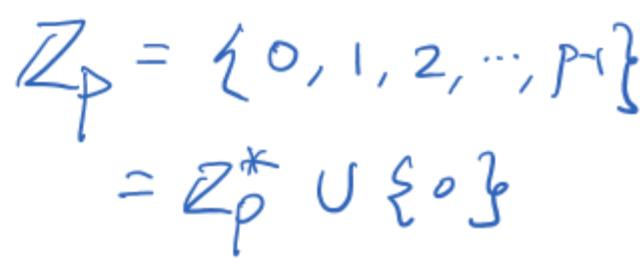

Generator

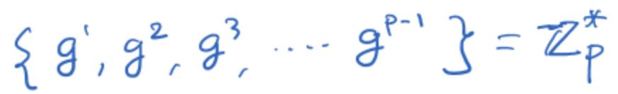

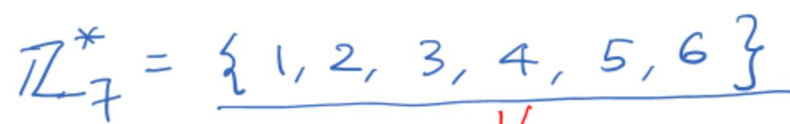

2\~s T

generatov

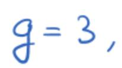

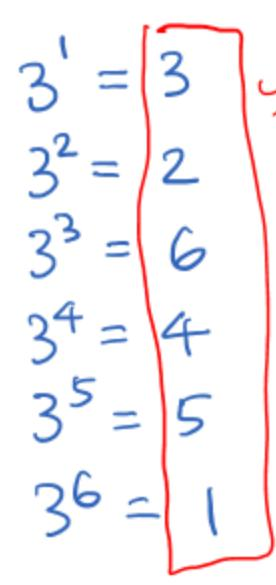

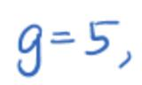

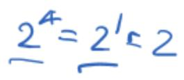

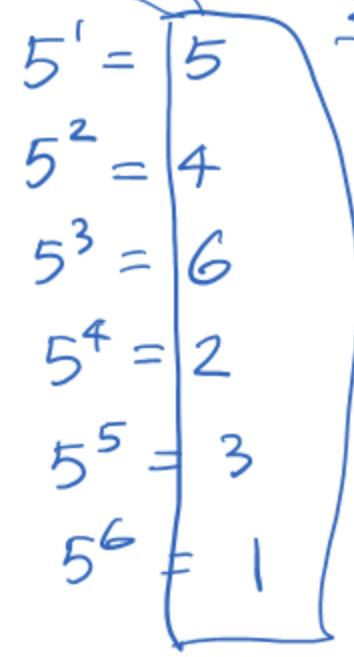

3 is α genera tor of Z

5 {s aso a geneatəf

RSA: the hardness of Factoring Problem (N= p·e) G{uen N、²²t {∽ HARD tσ fαl P＆＆.

\~ow)

## RSA setup randomly -ssc\`y

(é,N） pablic Rg

}.γPicR\~two prime numbers &

2.Cal N= P·&{()=(p）--）=[2)

3 randomy ρ²Ck é，s.t.ce,ψ))=1

4.a  α=éməd {(）（é·α=- Wd())

1 P=5、 ＆= 7

2 N= 35, φ(N)= (5-1).(7-1)= 24

3 pCk é=7

4 α = é}məd (） ≌） d·7= wod 24d= 7

. https://en.wikipedia.org/wiki/Extended_Euclidean_algorithm

## RSA Encryption /Decryption

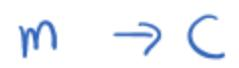

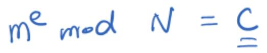

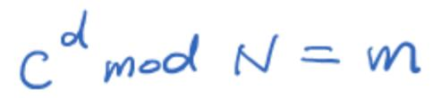

## RSA Signature

Generatios

ower (α,e,N)

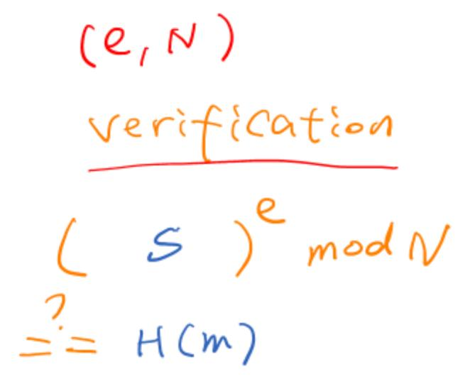

1.sisnatue {s from tne owner

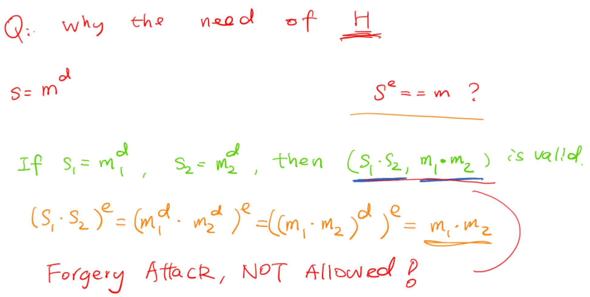

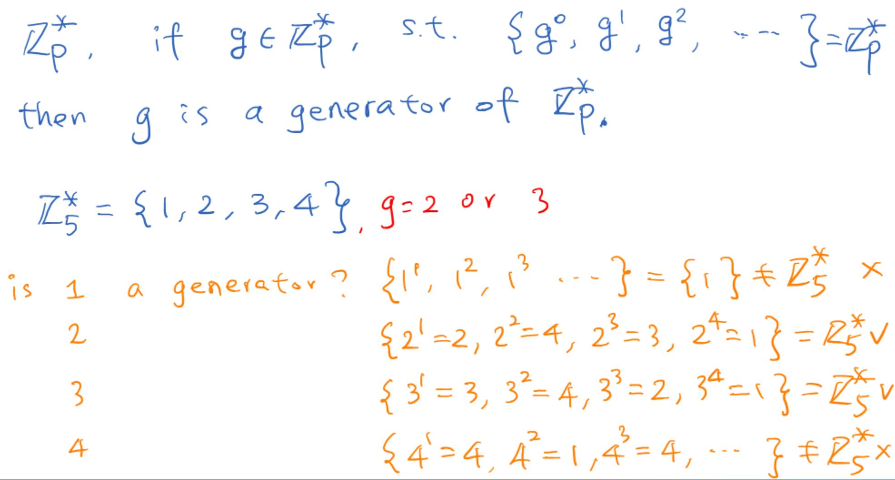